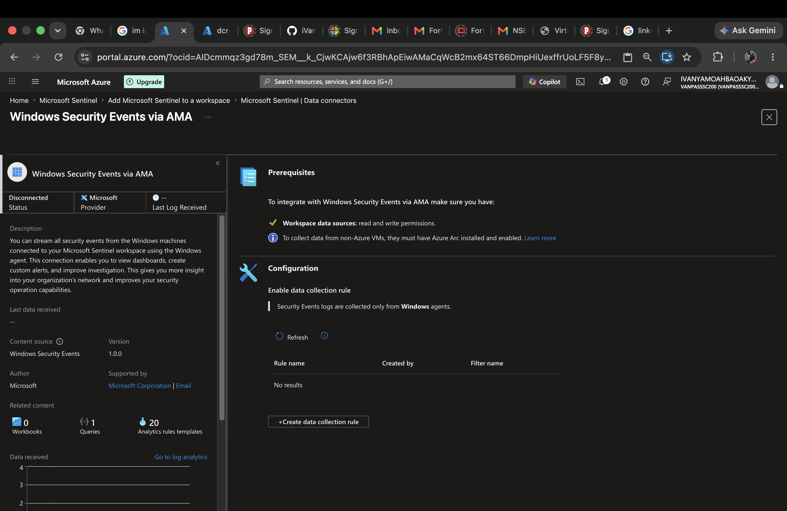
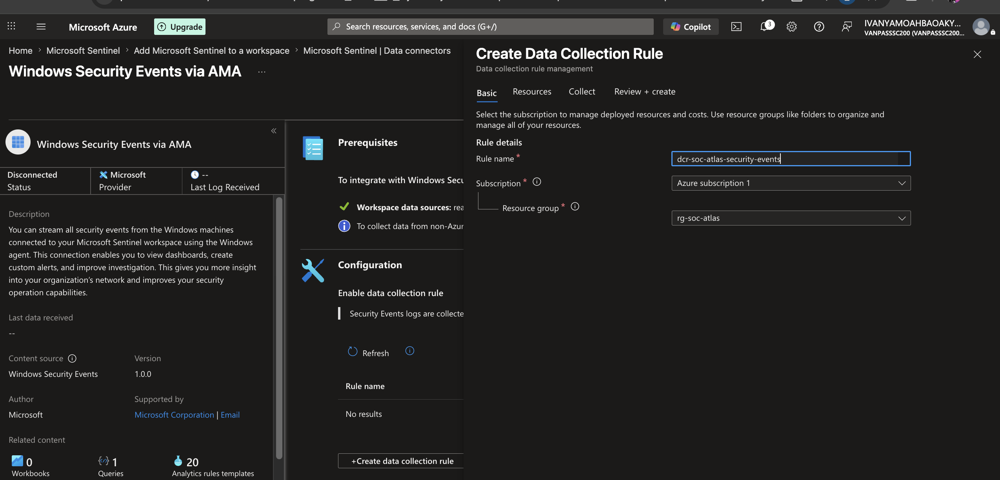
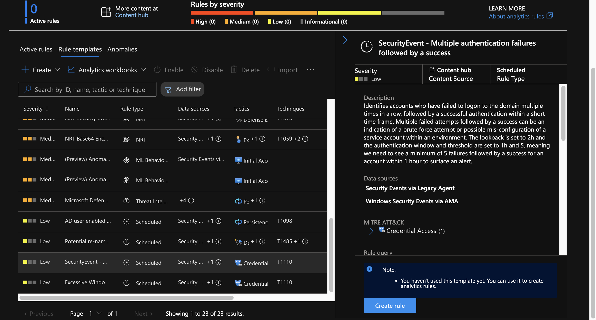
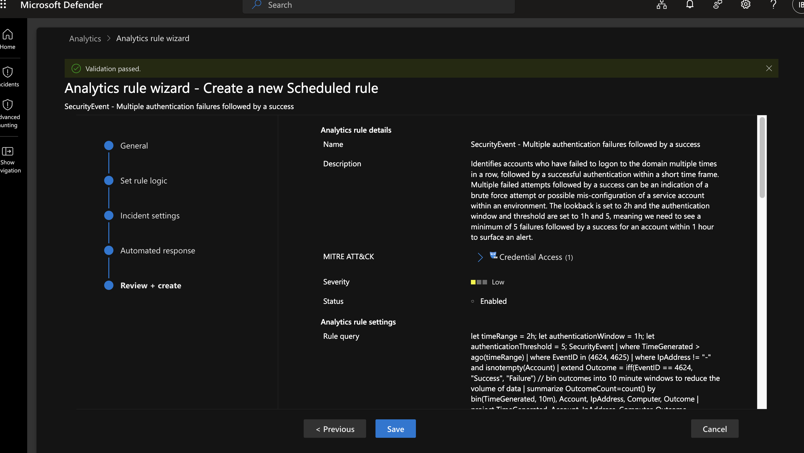

# Project ATLAS — Day 2 Walkthrough: Detection Engineering

Goal for today: confirm telemetry is actually flowing, enable one built-in Sentinel analytics rule, and author + schedule the two custom KQL rules (4.1 brute force, 4.2 encoded PowerShell) from the blueprint. ~2 hours.

You won't see these rules fire for real yet — that happens Day 3 when you generate the actual attack traffic. Today is about getting the plumbing correct so Day 3's activity has something to land in.

---

## Part A — Confirm telemetry is flowing (10–15 min)

Before building rules on top of data, confirm the data exists. This project's endpoint telemetry comes from Sysmon + Azure Arc + AMA into the `law-soc-atlas` workspace (Day 1, Part F) rather than Defender's own Advanced Hunting tables, so check it from the Sentinel **Logs** blade instead.

1. Go to **security.microsoft.com → Microsoft Sentinel → Logs** (or open the `law-soc-atlas` workspace directly in the Azure portal → **Logs**).
2. Run: `Heartbeat | where Computer contains "DESKTOP-TRF9U79" | take 10` (your machine's actual hostname — Azure Arc registers it under the Windows hostname, not the VirtualBox VM name)
3. You should see rows confirming the Azure Monitor Agent is checking in. If it's empty, give the Arc/AMA pipeline more time (initial sync can take 15+ minutes after the DCR's first association) or revisit Day 1, Part F, steps 24–26.
4. Once `Heartbeat` returns rows, also try: `SecurityEvent | take 10` and `Event | where Source == "Microsoft-Windows-Sysmon" | take 10`. These confirm the specific tables your custom rules depend on are populated.

Don't proceed to Part C/D until these return data — a rule built on an empty table will look "broken" later when it's really just waiting on data that was never there.

---

## Part B — Enable one out-of-box analytics rule template (15 min)

1. Go to **security.microsoft.com → Microsoft Sentinel → Configuration → Analytics → Rule templates** tab.
2. Filter or search by keyword — try **"failed sign"**, **"brute force"**, or **"PowerShell"**. Microsoft renames these templates fairly often, so search by concept rather than looking for an exact title.
3. Pick the closest match (commonly something like a failed-sign-in-followed-by-success template, or a Defender XDR–sourced template). Click it → **Create rule** → click through the wizard accepting the defaults → **Review + create** → **Create**.
4. If your Content Hub "Microsoft Defender XDR" solution (installed Day 1) shipped its own analytics rule template — often something like "Create incidents from Defender XDR alerts" — enabling that one too is worthwhile; it surfaces Defender for Office 365 and Entra ID Protection detections as Sentinel incidents alongside your custom rules. Note: with no Defender for Endpoint sensor in this build, this template won't pull in any endpoint-side alerts — rules 4.1 and 4.2 below are the entire endpoint detection layer here, not a supplement to a vendor one.

This step exists so your portfolio shows you can operate vendor-supplied detections, not just write your own from scratch — real SOC work is mostly tuning existing content.

---

## Part C — Custom rule 4.1: brute-force failed-logon spike (20 min)

1. **Configuration → Analytics → + Create → Scheduled query rule.**

   

2. **General tab:**
   - Name: `ATLAS - Brute force failed logon spike`
   - Description: detects 5+ failed logons to the same device from the same IP within a 5-minute window
   - Severity: **Medium**
   - Tactics: **Credential Access** · Technique: **T1110.001**
3. **Set rule logic tab** — paste this exactly (from the blueprint, Section 4.1):
   ```kql
   SecurityEvent
   | where TimeGenerated > ago(1d)
   | where EventID == 4625
   | summarize FailedAttempts = count(), Accounts = make_set(Account) by Computer, IpAddress, bin(TimeGenerated, 5m)
   | where FailedAttempts >= 5
   | order by FailedAttempts desc
   ```
   This reads the same Windows Security log EventID 4625 (failed logon) that Defender for Endpoint's `DeviceLogonEvents` would have summarized — just sourced from the `SecurityEvent` table the AMA-forwarded Security log lands in instead.

   

4. Click **Test with current data** — expect 0 results today (no attack yet), that's correct, not broken.
5. **Query scheduling**: set **Run query every: 5 minutes**, **Lookup data from the last: 5 minutes**. The `ago(1d)` inside the query is now redundant with the rule's own 5-minute window — that's harmless, just leave it; the rule's scheduling settings are what actually control how much data gets scanned each run.
6. **Alert threshold**: trigger when results are **greater than 0**.
7. **Entity mapping tab**: map **Host = Computer** and **IP address = IpAddress**. Skip mapping the `Accounts` field — it's an array (from `make_set`), and entity mapping needs a single scalar value, not a list.
8. **Incident settings tab**: leave "Create incidents from alerts triggered by this rule" **enabled**, grouping set to default (one incident per alert).
9. **Automated response tab**: skip for now — nothing to automate yet at this stage of the project.
10. **Review + create → Create.**

---

## Part D — Custom rule 4.2: encoded PowerShell execution (15 min)

1. **Configuration → Analytics → + Create → Scheduled query rule.**

   

2. **General tab:**
   - Name: `ATLAS - Encoded PowerShell execution`
   - Severity: **High** (obfuscated execution is a stronger signal than a single failed login)
   - Tactics: **Execution, Defense Evasion** · Techniques: **T1059.001, T1027**
3. **Set rule logic tab** — paste this (extends the blueprint's Section 4.2 query with one extra extracted field, `User`, so this rule has something clean to map in the Entity mapping tab):
   ```kql
   Event
   | where TimeGenerated > ago(1d)
   | where Source == "Microsoft-Windows-Sysmon" and EventID == 1
   | extend Image = extract(@"Image:\s*(.*?)\r?\n", 1, RenderedDescription)
   | extend CommandLine = extract(@"CommandLine:\s*(.*?)\r?\n", 1, RenderedDescription)
   | extend User = extract(@"User:\s*(.*?)\r?\n", 1, RenderedDescription)
   | where Image has_any ("powershell.exe", "powershell_ise.exe")
   | where CommandLine has_any ("-enc", "-EncodedCommand", "-e ")
   | project TimeGenerated, Computer, User, Image, CommandLine
   ```

   

   Worth a note for your README: MDE's `DeviceProcessEvents` gives you `AccountName` as a clean column already; Sysmon's raw `Event` rows bury the same value inside `RenderedDescription`'s text block, so it has to be pulled out with `extract()` like `Image` and `CommandLine` are. This is closer to real detection-engineering work against raw Windows Event Log data than against a vendor's pre-parsed EDR schema.
4. **Query scheduling**: **Run every 5 minutes**, **lookup last 5 minutes** — same reasoning as rule 4.1.
5. **Entity mapping**: map **Host = Computer** and **Account = User**.
6. **Incident settings**: leave incident creation enabled.
7. **Review + create → Create.**

---

## Part E — Confirm both rules are live (5 min)

1. Back in **Configuration → Analytics → Active rules**, confirm both show **Status: Enabled** with a green check.
2. Wait ~15 minutes, then check each rule's **Last run** timestamp updated — confirms the schedule is actually executing, even with 0 results.

---

## Why these two rules (keep this for your eventual report/README)

- **4.1 (brute force)** maps directly to Credential Access / T1110.001 — the JD line about "enhancing/creating analytic triggers" is best demonstrated by something you tuned yourself (the 5-attempts/5-minute threshold is a deliberate choice, not a default).
- **4.2 (encoded PowerShell)** maps to Execution + Defense Evasion / T1059.001 + T1027 — encoded PowerShell is one of the highest-signal, lowest-noise indicators in real SOC work, which is exactly why it's worth a dedicated rule instead of relying only on built-in detections.

Jot a one-line "why" like the two paragraphs above into your notes now — you'll lift it straight into the Day 5 report instead of reconstructing your reasoning later.

---

## End-of-day checklist

- Confirmed `Heartbeat`, `SecurityEvent`, and `Event` (Sysmon) all return data in the Sentinel Logs blade
- One out-of-box analytics rule template enabled
- Rule 4.1 (brute force) created, enabled, entity-mapped, running on schedule
- Rule 4.2 (encoded PowerShell) created, enabled, entity-mapped, running on schedule
- Short "why" notes saved for each custom rule

Tomorrow (Day 3) is when you actually generate the attack traffic these rules are waiting for. If a rule won't save, or entity mapping rejects a field, tell me the exact error text and we'll fix it before moving on.
