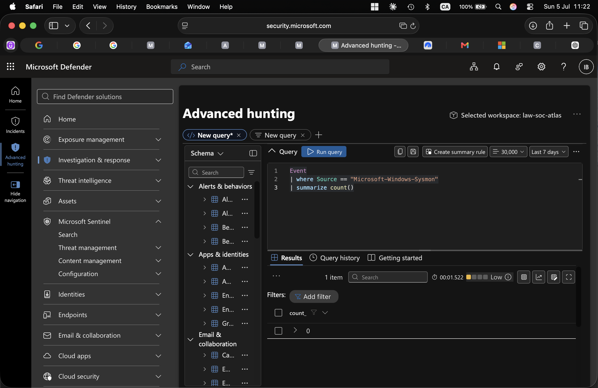

# Project ATLAS — Day 5 Walkthrough: Hunting, Docs & GitHub

Goal for today: run the two proactive hunts, write up the formal incident report, build the MITRE ATT&CK Navigator heatmap, and push everything to GitHub. ~2.5–3 hours. This is the day the portfolio piece actually comes together.

---

## Part A — Run the proactive hunts (15–20 min)

1. Open your **`law-soc-atlas`** workspace (or Sentinel's **Logs** blade in security.microsoft.com, now that it's connected — Day 1 Part G).
2. **Hunt 4.3 — traffic to the attacker IP.** Paste and run:
   ```kql
   let AttackerIP = "10.0.2.2"; // NOT Kali's own NAT IP -- under plain NAT (Day 1, Part B) the Windows VM only ever sees the host gateway as the remote endpoint; the reverse shell actually lands on Kali via the host's port-forward (44444 -> Kali 4444)
   Event
   | where TimeGenerated > ago(7d)
   | where Source == "Microsoft-Windows-Sysmon" and EventID == 3
   | extend Image = extract(@"Image:\s*(.*?)\r?\n", 1, RenderedDescription)
   | extend SourceIp = extract(@"SourceIp:\s*(.*?)\r?\n", 1, RenderedDescription)
   | extend DestinationIp = extract(@"DestinationIp:\s*(.*?)\r?\n", 1, RenderedDescription)
   | extend DestinationPort = extract(@"DestinationPort:\s*(.*?)\r?\n", 1, RenderedDescription)
   | where SourceIp == AttackerIP or DestinationIp == AttackerIP
   | project TimeGenerated, Computer, Image, SourceIp, DestinationIp, DestinationPort
   ```
   Run it. If the Sysmon/Event table returns 0 rows — this is the telemetry gap finding. Document it as a Priority 1 finding: the AMA pipeline was configured but not ingesting.

   

3. **Hunt 4.4 — risky sign-ins.**
   ```kql
   EntraIdSignInEvents
   | where Timestamp > ago(7d)
   | where RiskLevelAggregated >= 10   // 10 = low, 50 = medium, 100 = high
   | project Timestamp, AccountUpn, IPAddress, Country, City, RiskLevelAggregated, RiskState, ConditionalAccessStatus
   ```
   Run it. You should see the Tor sign-in flagged. Screenshot.
4. **Save both** as reusable queries (the Logs blade and Advanced Hunting both have a **Save → Save as new query** option), naming them e.g. `ATLAS - Hunt for attacker IP traffic` and `ATLAS - Hunt for risky sign-ins`. This demonstrates the "proactive threat hunting" JD bullet as an artifact, not just a one-off.

---

## Part B — Write the post-incident report (40–50 min)

Create `reports/incident-report.md` in your project folder and fill in each section with your **actual** results from Days 3–4 — don't leave placeholders in the version you publish. Structure:

1. **Executive summary** — your Day 4 root-cause narrative, polished to 3–5 sentences.
2. **Timeline of events** — a table: Timestamp | Stage | Action | Source.
3. **Indicators of compromise** — Kali's IP, the `soclab-test` account name, the encoded PowerShell command line, the test Entra account UPN.
4. **Detections triggered** — list each alert/incident by name with a one-line description of what fired it (your two custom rules, the Identity Protection risk detection).
5. **Response actions taken** — manual host-based firewall containment (and release), risky-user remediation, the Conditional Access policy (note it's Report-only and why).
6. **MITRE ATT&CK mapping** — pull the table straight from the blueprint's Section 3.
7. **Lessons learned / what a real SOC would add** — this is the section that actually impresses a reviewer. Be honest about the lab's limits: no real perimeter firewall (Sysmon's network-connection telemetry stood in for it), single analyst doing both red and blue sides, and the fact that Defender for Endpoint's licensing dried up mid-build, which is *why* the EDR layer ended up being a self-built Sysmon + Azure Arc + AMA pipeline instead of a vendor agent. Naming these substitutions explicitly reads as more credible than pretending the lab was enterprise-grade — and the pivot story itself is a good interview anecdote about adapting under a real constraint.

---

## Part C — MITRE ATT&CK Navigator heatmap (25–30 min)

A correction worth flagging: the original blueprint referenced `navigator.mitre.org` for this — the actual current tool lives at **https://mitre-attack.github.io/attack-navigator/**. Use that URL.

1. Open **https://mitre-attack.github.io/attack-navigator/**.
2. **Create New Layer → Enterprise** (domain).
3. Use the technique search/select control to find and select each of the techniques from the blueprint's Section 3 table: T1595, T1566.002, T1078.004, T1090.003, T1110.001, T1059.001, T1027, T1071 (and T1136 if you did the optional persistence stretch).
4. For each selected technique, open its panel and add a short **comment** describing how Project ATLAS executed it (e.g., for T1110.001: "Hydra brute force against RDP, Day 3") and optionally set a background color so the selected techniques stand out visually.
5. Use the **layer controls** icon row above the matrix:
   - Download icon → **Download as JSON** → save as `attack-navigator-layer.json`
   - Camera/image icon → **Download as SVG** → this becomes the heatmap image for your README
6. This single artifact — a heatmap with your own annotations — is one of the strongest visual signals in the whole repo for someone skimming quickly.

---

## Part D — Repo structure and push (30–40 min)

Recommended structure:

```
project-atlas-soc-simulation/
├── README.md
├── docs/
│   ├── Day-1-Setup-Guide.md
│   ├── Day-2-Detection-Engineering-Guide.md
│   ├── Day-3-Attack-Simulation-Guide.md
│   ├── Day-4-Investigation-Containment-Guide.md
│   └── Day-5-Hunting-Docs-GitHub-Guide.md
├── screenshots/
│   ├── day1-vm-setup.png
│   ├── day3-nmap-scan.png
│   ├── day3-hydra-success.png
│   ├── day3-reverse-shell.png
│   ├── day3-phishing-click.png
│   ├── day3-tor-risk.png
│   ├── day4-incident-triage.png
│   ├── day4-device-containment.png
│   ├── day4-conditional-access.png
│   └── day5-hunt-results.png
├── kql-queries/
│   ├── 4.1-bruteforce-detection.kql
│   ├── 4.2-encoded-powershell-detection.kql
│   ├── 4.3-hunt-attacker-ip.kql
│   └── 4.4-hunt-risky-signins.kql
├── reports/
│   └── incident-report.md
└── attack-navigator-layer.json
```

**Before pushing**, scrub anything tenant-identifying from screenshots and queries — your real domain name, your real email, anything beyond the disposable test account. Recruiters will actually open this repo.

**Push it:**

1. On **github.com → New repository** → name it (e.g. `project-atlas-soc-simulation`) → **Public** → **Create repository** (don't initialize with a README — you already have one).
2. Locally, in your project folder:
   ```bash
   git init
   git add .
   git commit -m "Initial commit: Project ATLAS SOC Tier 1 simulation"
   git branch -M main
   git remote add origin https://github.com/<your-username>/project-atlas-soc-simulation.git
   git push -u origin main
   ```

---

## End-of-project checklist

- Hunts 4.3 and 4.4 run, results screenshotted, saved as reusable queries
- Incident report written with your real data (no placeholders)
- ATT&CK Navigator layer built, annotated, exported as JSON and SVG
- Repo structured, scrubbed of tenant-identifying details, pushed to GitHub

Once this is live, come back and we'll build the four things that turn this into a job-search asset: the GitHub documentation polish pass, a LinkedIn posting strategy, a Loom video walkthrough script, and a recruiter outreach angle — all stronger once built from your actual screenshots and results instead of drafted in advance.
