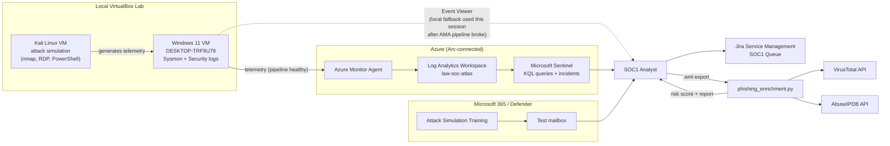
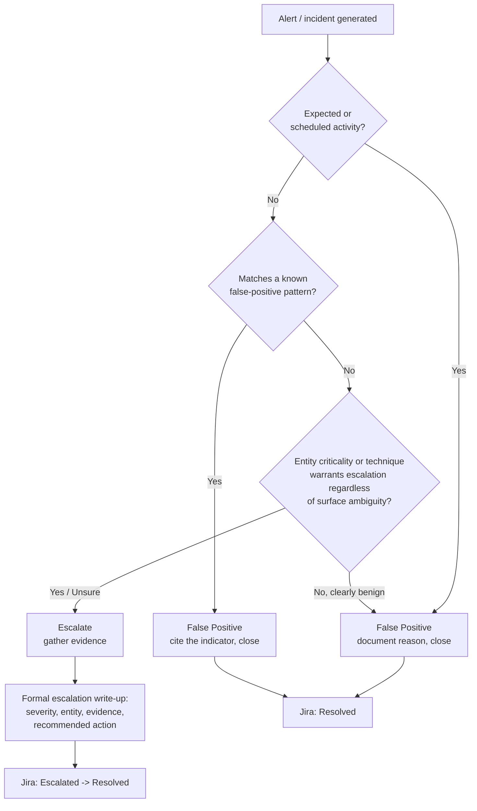
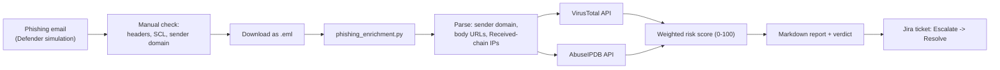

# Project BEACON — Tier 1 SOC Analyst Simulation

A single-session (~6 hour) simulation of a Tier 1 Security Operations Center analyst shift: alert triage, investigation, escalation, and phishing analysis, built on Microsoft Sentinel, Jira Service Management, and Windows/Sysmon telemetry — plus a custom Python automation pipeline for IOC enrichment.

This is a companion project to [Project ATLAS](../Project-ATLAS) (a senior-level incident response/detection engineering simulation reusing the same Azure backend). BEACON is scoped specifically to entry-level Tier 1 SOC analyst work: fast, high-volume alert triage against a written playbook, ticketing discipline, and phishing investigation — the day-to-day of a SOC1 seat, not architecture or detection engineering.

## Role context

Simulates the alert-triage and phishing-investigation responsibilities found in Tier 1 SOC analyst job descriptions: working a shared alert queue, applying a documented triage playbook consistently, escalating true positives with evidence, and investigating suspected phishing without detonating payloads.

## Architecture

Reuses Project ATLAS's Azure backend (Log Analytics workspace `law-soc-atlas`, Azure Arc-connected Windows VM, Microsoft Sentinel) with an entirely new alert batch, playbook, and phishing scenarios layered on top.



## Procedure — step by step

### Phase 1: Environment check
1. Confirm both VMs (Kali, Windows 11) running via VirtualBox.
2. Verify Azure Arc connectivity (`azcmagent show` → `Agent Status: Connected`).
3. Confirm Azure trial subscription still active.

### Phase 2: Alert generation & triage
1. Generate 5 distinct alert patterns from Kali against the Windows VM: fast port scan (`nmap -sV`), stealthy port scan (`nmap -sS -T2`), RDP auth-failure burst, benign PowerShell command, encoded/obfuscated PowerShell command.
2. Write [`Alert-Triage-Playbook.md`](Alert-Triage-Playbook.md): one section per alert type — trigger condition, initial checks, false-positive indicators, escalation criteria, required evidence — plus a decision tree (diagram below).
3. Create one Jira ticket per alert in the `SOC1 Queue`.
4. Triage each ticket against the playbook (not ad hoc judgment): note severity/entity/timestamp, run the relevant query, write a one-line verdict.



### Phase 3: Escalation
1. For each **Escalate** verdict (RDP auth-failure burst, encoded PowerShell), gather supporting evidence:
   - SHA256 hash of the executing binary, verified via VirusTotal.
   - Full event timeline reconstructed from the Windows Security log (`Get-WinEvent` + XPath filter on `TargetUserName`).
2. Write a formal handoff: severity, affected entity, summary, evidence, recommended action, escalated-by + timestamp.
3. Attach to the Jira ticket, move to Escalated, then Resolved with a closing note.

### Phase 4: Phishing investigation & automation
1. Launch two Defender Attack Simulation Training scenarios: **Credential Harvest** and **Link in Attachment**, targeting a test mailbox.
2. Investigate each landed email manually first: sender/display-name mismatch, `X-MS-Exchange-Organization-SCL` header, authentication results — without clicking any embedded link/attachment.
3. Download each email as `.eml` and run the automation pipeline below.
4. Log each scenario as a Jira ticket with the findings and automated risk score, through to Resolved.



### Phase 5: Documentation
1. Compile [`Shift-Log.md`](Shift-Log.md) — metrics pulled directly from the Jira queue.
2. Compile [`Challenges-Lessons-Learned.md`](Challenges-Lessons-Learned.md) — real trial-and-error, filtered to SOC-relevant findings only.
3. Capture screenshots at key milestones (queue overview, one triage decision, hash verification, phishing headers, both automation runs).

## What was built

- **Alert generation & triage:** 5 distinct alert patterns, each triaged against a written [Alert Triage Playbook](Alert-Triage-Playbook.md) with a documented decision tree.
- **Ticketing:** Every alert and phishing scenario tracked as its own ticket in a Jira Service Management queue (`SOC1 Queue`) from Open through Escalated/Resolved.
- **Escalation:** Two alerts escalated with formal handoff write-ups, supported by SHA256 hash verification (VirusTotal) and event-timeline reconstruction from the Windows Security log.
- **Phishing investigation:** Two Microsoft Defender Attack Simulation Training scenarios, investigated via headers/authentication signals without detonating any payload.
- **Custom automation:** Built [`phishing_enrichment.py`](phishing_enrichment.py) — a Python pipeline that parses a raw `.eml`, extracts sender domain/URLs/IPs, enriches each against the VirusTotal and AbuseIPDB APIs, and computes a weighted risk score — a lightweight prototype of what a SOAR playbook (Sentinel Logic Apps, Cortex XSOAR) automates in production.
- **Infrastructure troubleshooting:** Diagnosed a broken Azure Monitor Agent telemetry pipeline and a network-layer RDP simulation blocker, pivoting the evidence source/delivery method in both cases rather than losing the alert type — see [Challenges & Lessons Learned](Challenges-Lessons-Learned.md).

## Metrics

See [Shift-Log.md](Shift-Log.md) for the full breakdown. Headline: 7 alerts/incidents reviewed, 43% false-positive rate, 4 escalations — all supported by documented evidence.

## Skills demonstrated

| Area | Tools / techniques |
|---|---|
| SIEM & log analysis | Microsoft Sentinel, KQL, Windows Event Viewer, Sysmon |
| Ticketing & workflow | Jira Service Management |
| Threat intelligence | VirusTotal, AbuseIPDB (manual + API-driven) |
| Automation / SOAR concepts | Python (email parsing, REST API integration, risk scoring) |
| Email/phishing investigation | Header analysis, SPF/DKIM/DMARC concepts, Defender Attack Simulation Training |
| Windows internals | PowerShell (`Get-WinEvent`, `Get-FileHash`), Event Viewer XPath filtering |
| Cloud infrastructure troubleshooting | Azure Arc, Azure Monitor Agent, Log Analytics |

## Challenges & lessons learned

See [Challenges-Lessons-Learned.md](Challenges-Lessons-Learned.md) — covers the Azure Monitor Agent telemetry diagnosis, an infrastructure-driven pivot on the RDP simulation, a real blind spot discovered in the automated phishing enrichment pipeline, and a Windows Event Viewer filtering gotcha.

## Screenshots

_Add captured screenshots to a `screenshots/` folder in this directory and reference them here, e.g.:_

```


```

Recommended set: Jira queue with all 7 tickets, one triage decision detail, the VirusTotal hash verification result, the Windows Event Viewer timeline query, both phishing emails as received, both `phishing_enrichment.py` terminal runs, and the Azure Monitor Agent "Succeeded"-but-missing-service contradiction.

---

*Subscription IDs and account identifiers redacted throughout. This project uses a personal Azure trial subscription and a local VirtualBox lab environment.*
