<div align="center">


# Project ATLAS — Microsoft SOC Tier 1/2 Simulation

> A self-directed, end-to-end Security Operations Centre simulation built on Microsoft Sentinel, Entra ID Protection, and a custom attacker/victim lab. Designed to demonstrate senior SOC analyst competencies across the full incident lifecycle: detection engineering, adversary simulation, triage, containment, identity remediation, and proactive threat hunting.

[](https://learn.microsoft.com/en-us/certifications/exams/sc-200/)
[](https://azure.microsoft.com/en-us/products/microsoft-sentinel)
[](https://security.microsoft.com)
[](https://attack.mitre.org/)
[]()

</div>

---

## Table of Contents

1. [Lab Architecture](#1-lab-architecture)
2. [Day 1 — Lab Provisioning & Infrastructure Setup](#2-day-1--lab-provisioning--infrastructure-setup)
3. [Day 2 — Telemetry Pipeline: Sysmon + Azure Arc + AMA + DCR](#3-day-2--telemetry-pipeline-sysmon--azure-arc--ama--dcr)
4. [Day 2 — Detection Engineering: Custom Sentinel Analytics Rules](#4-day-2--detection-engineering-custom-sentinel-analytics-rules)
5. [Day 3 — Attack Simulation: MITRE ATT&CK Execution](#5-day-3--attack-simulation-mitre-attck-execution)
6. [Day 4 — Incident Triage & Investigation (Defender XDR)](#6-day-4--incident-triage--investigation-defender-xdr)
7. [Day 5 — Containment, Identity Remediation & Threat Hunting](#7-day-5--containment-identity-remediation--threat-hunting)
8. [Key Findings & Gaps](#8-key-findings--gaps)
9. [MITRE ATT&CK Coverage](#9-mitre-attck-coverage)
10. [KQL Detection Rules](#10-kql-detection-rules)
11. [Threat Hunt Queries](#11-threat-hunt-queries)
12. [Deliverables](#12-deliverables)

---

## 1. Lab Architecture

The lab simulates a hybrid enterprise environment: a local victim machine running inside VirtualBox on an Apple Silicon MacBook Air is connected to Azure via Azure Arc. A Kali Linux VM on the same NAT network acts as the attacker. All endpoint telemetry (Sysmon + Windows Security Events) flows through the Azure Monitor Agent (AMA) into a Log Analytics Workspace, with Microsoft Sentinel and Defender XDR providing SIEM/XDR detection coverage. Identity attacks are handled by Entra ID Protection.

### Environment Summary

| Component | Detail |
|-----------|--------|
| Host Machine | MacBook Air M4 (ARM64) · macOS |
| Victim VM | Windows 11 ARM64 · `DESKTOP-TRF9U79` · VirtualBox NAT `10.0.2.2:33389` |
| Attacker VM | Kali Linux ARM64 · VirtualBox NAT `10.0.2.15` |
| Azure Tenant | `VANPASSSC200.onmicrosoft.com` |
| Azure Region | East US |
| Resource Group | `rg-soc-atlas` |
| Log Analytics Workspace | `law-soc-atlas` |
| SIEM | Microsoft Sentinel (connected to `law-soc-atlas`) |
| XDR | Microsoft Defender XDR |
| Identity | Entra ID P2 · Identity Protection · Conditional Access |
| Endpoint Telemetry | Sysmon v15.21 + AMA + DCR `dcr-soc-atlas-sysmon` |

---

## 2. Day 1 — Lab Provisioning & Infrastructure Setup

The first session focused on building the cloud and identity foundation: provisioning the Azure resource group, enabling Entra ID P2, creating the Log Analytics Workspace, onboarding the Windows VM to Azure Arc, and activating Microsoft Sentinel.

### Step 1 — Assign Entra ID P2 Licenses

Entra ID P2 is required for Identity Protection (risky sign-in detection) and Conditional Access policies. Without it, the identity-based attacks in Days 3–5 would go completely undetected.


*Entra ID P2 license assigned to the test account — enables Identity Protection and Conditional Access*

### Step 2 — Onboard Windows VM to Azure Arc

Azure Arc is the bridge that lets a non-Azure machine (our VirtualBox VM) appear as a managed resource in the Azure portal. Without Arc, there is no way to attach a Data Collection Rule or install the Azure Monitor Agent.

The Arc onboarding script was generated from the Azure portal and executed in an elevated PowerShell session on `DESKTOP-TRF9U79`.

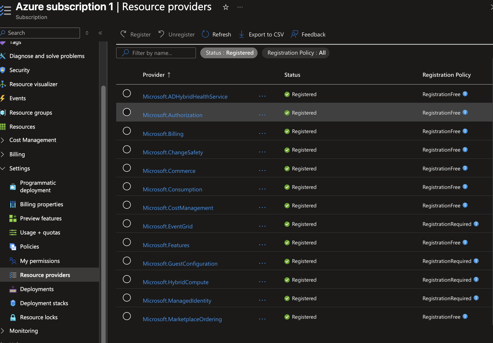
*Azure Arc onboarding script generated for Windows — ready to deploy to the victim VM*

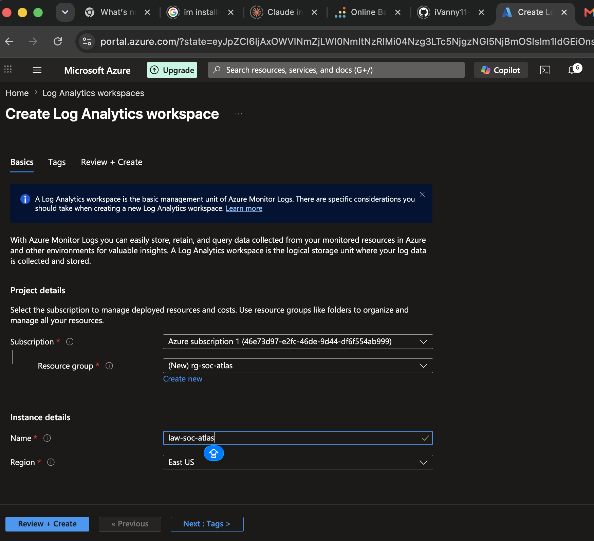
*Arc installation script running on DESKTOP-TRF9U79 inside VirtualBox — authenticating against Azure*

### Step 3 — Create Log Analytics Workspace

The Log Analytics Workspace (`law-soc-atlas`) is the central log store. Every security event from the endpoint and every alert from Sentinel and Defender XDR flows into this workspace.

### Step 4 — Activate Microsoft Sentinel

Microsoft Sentinel is connected to `law-soc-atlas`, enabling the SIEM layer: analytics rules, incidents, workbooks, and the SOAR playbook.

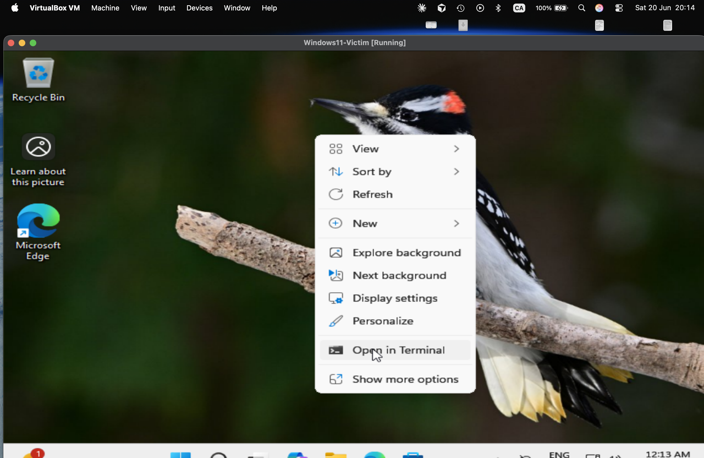
*Microsoft Sentinel successfully connected to the law-soc-atlas workspace — SIEM layer active*

---

## 3. Day 2 — Telemetry Pipeline: Sysmon + Azure Arc + AMA + DCR

With the cloud foundation in place, the next session built the endpoint telemetry pipeline. The goal: stream Sysmon process events and Windows Security Event 4625 (failed logon) from the victim VM into Sentinel in real time.

### Step 1 — Verify Azure Arc Connectivity

Before installing any agents, Arc connectivity must be confirmed — a "Connected" status means the VM is registered as an Azure resource and can receive policy assignments.


*DESKTOP-TRF9U79 status: Connected in Azure Arc — VM is registered as a hybrid machine in rg-soc-atlas*

### Step 2 — Install Sysmon v15.21 with SwiftOnSecurity Config

Sysmon (System Monitor) is a Windows system service that logs detailed process creation, network connection, and file creation events to the Windows Event Log. The SwiftOnSecurity configuration is the industry-standard baseline — it filters out noise while capturing all attacker-relevant events.

```powershell
# Installation command (run as Administrator on DESKTOP-TRF9U79)
.\Sysmon64.exe -accepteula -i sysmonconfig-export.xml
```

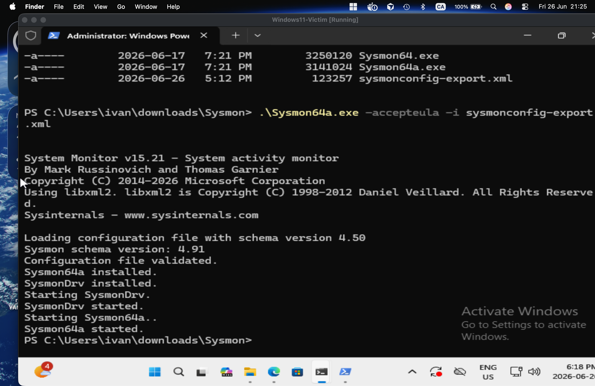
*PowerShell output: "Sysmon64a started" — Sysmon v15.21 installed with SwiftOnSecurity baseline config*

### Step 3 — Verify Sysmon is Generating Events Locally

Before trusting the cloud pipeline, verify that Sysmon is writing events locally to Event Viewer. This isolates any future telemetry gap to the AMA → DCR layer rather than the Sysmon service itself.


*Event Viewer: Microsoft-Windows-Sysmon/Operational — 45 events, 68 KB. Sysmon is writing locally. Pipeline verification step 1 of 2.*

The Sysmon operational log shows EID 1 (Process Create) events populating in real time — confirming the sensor is working at the endpoint level.

### Step 4 — Create Data Collection Rule (DCR)

The DCR (`dcr-soc-atlas-sysmon`) defines *what* to collect and *where* to send it. It is scoped to the Azure Arc machine and configured to forward two data sources:
- `Microsoft-Windows-Sysmon/Operational` (all Sysmon events)
- Windows Security Event ID 4625 (failed logon)

**DCR Configuration:**

| Setting | Value |
|---------|-------|
| DCR Name | `dcr-soc-atlas-sysmon` |
| Resource Group | `rg-soc-atlas` |
| Platform Type | Windows |
| Scope (Resource) | `DESKTOP-TRF9U79` (Azure Arc machine) |
| Data Source 1 | `Microsoft-Windows-Sysmon/Operational` |
| Data Source 2 | Windows Security Events — EID 4625 |
| Destination | Log Analytics Workspace `law-soc-atlas` |

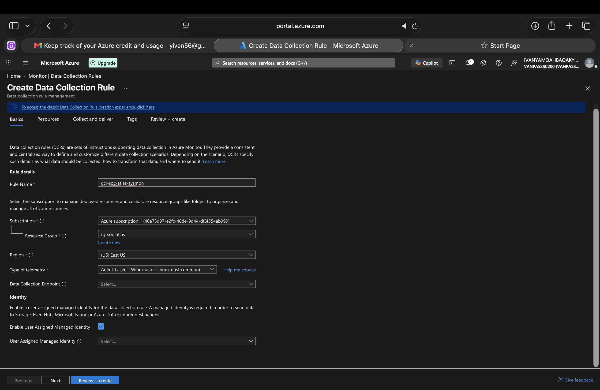
*DCR dcr-soc-atlas-sysmon being created — Basics tab: name, region, platform type*


*DCR Data Sources tab: Microsoft-Windows-Sysmon/Operational + Windows Security EID 4625 configured*

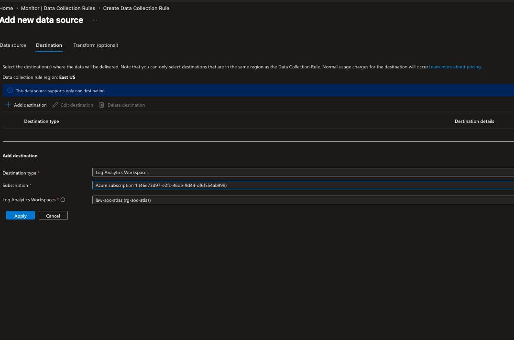
*DCR destination: Log Analytics Workspace law-soc-atlas — all telemetry will flow here*

### Step 5 — Verify AMA Extension Installs on Arc Machine

When a DCR is applied to an Azure Arc machine, Azure automatically provisions the Azure Monitor Agent (AMA) extension on that machine. This is the component that reads the Event Log and ships data to the DCR.

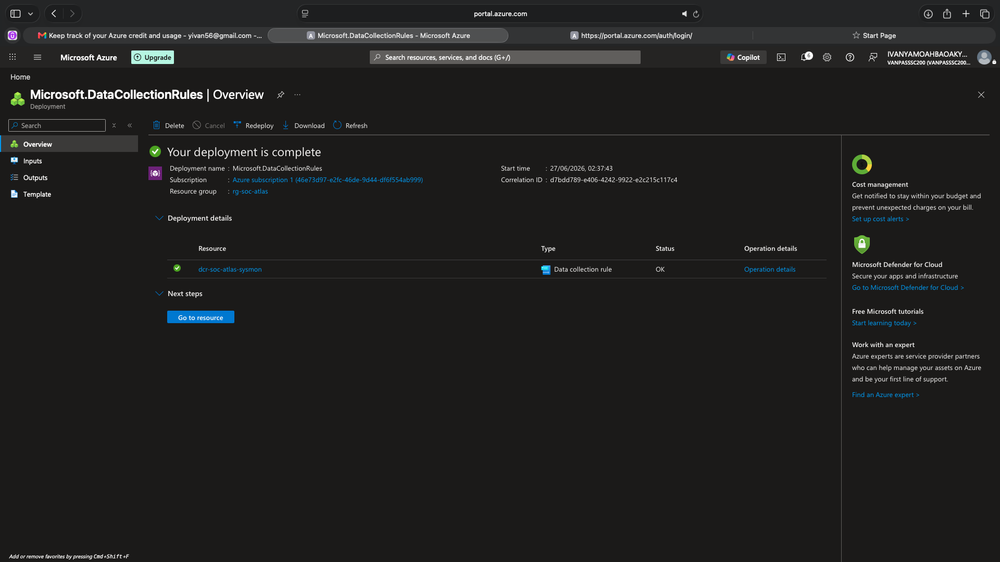
*Azure Monitor Agent extension installed on DESKTOP-TRF9U79 via Azure Arc — telemetry pipeline provisioned*

> **Critical Finding (Day 5):** Despite the AMA extension showing as installed, the `SecurityEvent` table and `Event` (Sysmon) table in `law-soc-atlas` both returned 0 records. This AMA pipeline failure is the central finding of the [Threat Hunt Report](#11-threat-hunt-queries) — the pipeline looked healthy but delivered nothing.

---

## 4. Day 2 — Detection Engineering: Custom Sentinel Analytics Rules

With the telemetry pipeline in place, the next focus was building custom analytics rules in Microsoft Sentinel to detect the specific attack techniques being simulated. Two rules were written from scratch using KQL.

### Rule 4.1 — Brute Force Failed Logon Spike (T1110.001)

This rule detects when 5 or more failed logon attempts (EID 4625) occur from the same source IP in a 5-minute window — the classic signature of an automated password-guessing attack.

The rule was built using the Sentinel Analytics Rule wizard with full entity mapping (Computer, IpAddress) to ensure incidents automatically enrich with asset context.


*Sentinel analytics rule wizard — creating Rule 4.1: Brute Force Failed Logon Spike*


*KQL query for Rule 4.1 validated in Sentinel — SecurityEvent EID 4625 with 5-minute window aggregation*

**Rule 4.1 — KQL:**
```kql
SecurityEvent
| where TimeGenerated > ago(1d)
| where EventID == 4625
| summarize FailedAttempts = count(), Accounts = make_set(Account) by Computer, IpAddress, bin(TimeGenerated, 5m)
| where FailedAttempts >= 5
| order by FailedAttempts desc
```

**Rule Settings:**

| Setting | Value |
|---------|-------|
| Rule Name | Brute Force Failed Logon Spike |
| Severity | Medium |
| MITRE Tactic | Credential Access |
| MITRE Technique | T1110.001 |
| Query Frequency | Every 5 minutes |
| Alert Threshold | ≥ 5 failed logons per 5-min window |
| Entity Mapping | Computer, IpAddress |

### Rule 4.2 — Encoded PowerShell Execution (T1059.001 + T1027)

This rule detects PowerShell processes launched with the `-enc` / `-EncodedCommand` flag — the most common obfuscation technique used by attackers to hide payload content from basic command-line logging. The query parses Sysmon EID 1 (Process Create) events from the `Event` table.


*Creating Rule 4.2 — Encoded PowerShell Execution via Sysmon EID 1*


*KQL for Rule 4.2: parsing Sysmon RenderedDescription to extract Image, CommandLine, and User fields*

**Rule 4.2 — KQL:**
```kql
Event
| where TimeGenerated > ago(1d)
| where Source == "Microsoft-Windows-Sysmon" and EventID == 1
| extend Image = extract(@"Image:\s*(.*?)\r?\n", 1, RenderedDescription)
| extend CommandLine = extract(@"CommandLine:\s*(.*?)\r?\n", 1, RenderedDescription)
| extend User = extract(@"User:\s*(.*?)\r?\n", 1, RenderedDescription)
| where Image has_any ("powershell.exe", "powershell_ise.exe")
| where CommandLine has_any ("-enc", "-EncodedCommand", "-e ")
| project TimeGenerated, Computer, User, Image, CommandLine
```

**Rule Settings:**

| Setting | Value |
|---------|-------|
| Rule Name | Encoded PowerShell Execution |
| Severity | High |
| MITRE Tactic | Execution + Defense Evasion |
| MITRE Technique | T1059.001 + T1027 |
| Data Source | Sysmon EID 1 via `Event` table |

### Both Rules Active


*Both custom analytics rules running in Sentinel — detection engineering phase complete*

---

## 5. Day 3 — Attack Simulation: MITRE ATT&CK Execution

With detection rules live, the simulation phase began. Five MITRE ATT&CK techniques were executed across endpoint and cloud attack surfaces.

### Technique 1 — Network Reconnaissance (T1046)

Before launching any attacks, Nmap was used from the Kali VM to confirm what services are exposed on the victim host. The RDP port had been forwarded on NAT port 33389 to allow the Hydra brute force tool to reach the Windows VM.

```bash
nmap -p 33389 10.0.2.2
```


*Nmap output from Kali: 33389/tcp open ms-wbt-server — RDP is exposed and reachable*

### Technique 2 — Brute Force: Password Guessing (T1110.001)

Hydra was used to simulate an automated credential attack against the Windows VM's RDP service. A custom wordlist of 7 passwords was used to simulate a targeted attack rather than a generic spray.

```bash
hydra -l ivan -P /tmp/password.txt rdp://10.0.2.2:33389
```


*Hydra v9.5 executing RDP brute force against 10.0.2.2:33389 — T1110.001 in progress*

> **Note:** Windows 11 Network Level Authentication (NLA) blocked Hydra at the transport layer, preventing credential validation. This is documented as a tool limitation — not a detection success. The failed logon events (EID 4625) that would have been generated by NLA-blocked attempts were the intended trigger for Rule 4.1.

### Technique 3 — Encoded PowerShell Execution (T1059.001 + T1027)

The encoded PowerShell attack was executed directly on the Windows VM. The `whoami` command was Base64-encoded and passed via `-enc` to simulate a real obfuscated payload execution.

```powershell
# Encoding
$cmd = "whoami"
$bytes = [System.Text.Encoding]::Unicode.GetBytes($cmd)
$e = [Convert]::ToBase64String($bytes)
# Execution
powershell -enc $e
```


*T1059.001 + T1027: `powershell -enc $e` executes and returns `desktop-trf9u79\ivan` — obfuscated payload runs successfully*

### Technique 4 — Spearphishing Link (T1566.002)

A Microsoft 365 Attack Simulation Training campaign was launched from the Defender XDR portal using the "Baseline Credential Harvest" template. This simulates a realistic phishing email that lures users to a fake login page to harvest credentials.


*T1566.002: Phishing email delivered to IVAN YAMOAH BAOAKYE's inbox — "Office 365 [System Message]" credential harvest lure*

**Simulation Result — 100% Compromise:**


*Attack Simulation Training report: 1/1 users clicked the link (30m 30s), 1/1 credentials submitted (43m 42s) — 100% compromise rate*

This result drives a direct recommendation: mandatory security awareness training is required before any other identity control is effective.

### Technique 5 — Valid Accounts + Multi-hop Proxy / Tor (T1078.004 + T1090.003)

A dedicated test account (`soc-tor-test@VANPASSSC200.onmicrosoft.com`) was created and licensed with Entra ID P2. The Tor Browser was then used to sign into both the admin account and the test account, simulating an attacker using anonymized infrastructure to access cloud resources.


*T1090.003 — Tor Browser signs into the admin account; Entra ID triggers MFA number-matching prompt*


*T1090.003 success — admin account accessed the Entra ID admin center via Tor exit node (sign-in succeeded)*

---

## 6. Day 4 — Incident Triage & Investigation (Defender XDR)

With the identity attacks executed, Microsoft Defender XDR auto-correlated multiple Entra ID Protection alerts into a single High-severity incident. This section documents the full triage and investigation workflow.

### Risky Sign-ins Detected by Entra ID Protection

Entra ID Protection fired within minutes of the Tor sign-ins, generating 5 risky sign-in events flagged as "At risk" from anonymous IP addresses across multiple Tor exit nodes in Germany, Sweden, and the Netherlands.


*Entra ID Protection: 5 risky sign-in events for IVAN YAMOAH BAOAKYE — all "At risk", sourced from Tor exit nodes (DE, SE, NL)*

Drilling into a single risky sign-in confirms two concurrent detections against the same sign-in event:

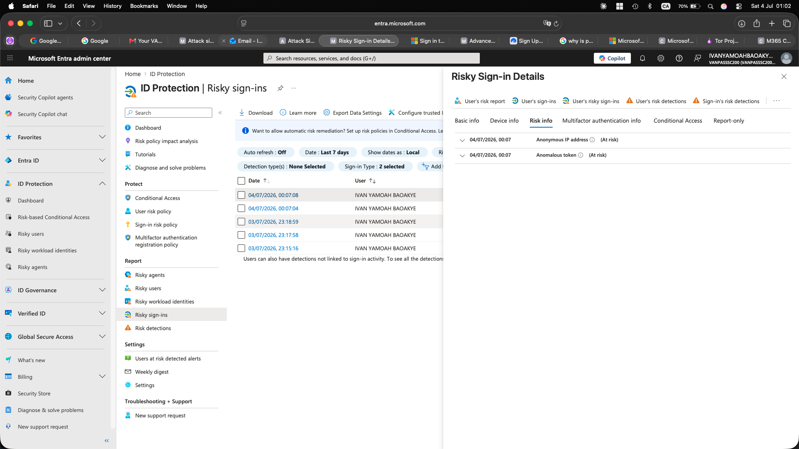
*Risk detail: Anonymous IP address (At risk) + Anomalous token (At risk) — both ML-based detections fired simultaneously*

| Detection | Type | Risk Level | Source |
|-----------|------|-----------|--------|
| Anonymous IP address | ML-based | High | Tor exit node (Karlsruhe, DE) |
| Anomalous token | ML-based | High | Same sign-in session |

### Incident ID 2 — Auto-Correlated by Defender XDR

Defender XDR automatically correlated 8 of the 9 Identity Protection alerts into **Incident ID 2**, classified as "Initial access incident involving one user." No manual incident creation was required — the XDR correlation engine did this automatically.


*Defender XDR Incidents: Incident ID 2 — High severity, 8/9 alerts, Identity Protection source, impacted user: IVAN YAMOAH BAOAKYE*

### Attack Story — Incident Graph + AI Triage

The Defender XDR attack story view shows the full incident graph: one user account, two Tor exit IP addresses, and 8 correlated alerts. The AI-generated threat profile identified the technique as "Token theft and token replay for unauthorized access."

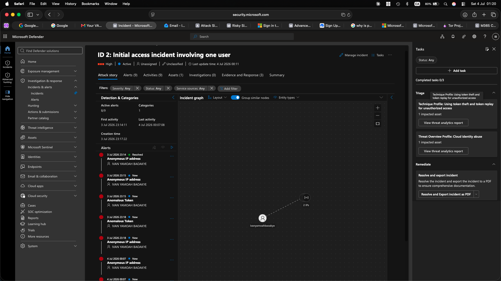
*Incident ID 2 attack story: alert timeline, incident graph (1 user → 2 Tor IPs), AI threat profiling — technique: token theft and replay*

### Incident Classification — True Positive

After reviewing the evidence (risky sign-in events, Tor exit node IPs, and correlated alerts), the incident was classified as a True Positive — Compromised Account. This escalation decision and classification mirrors Tier 2 escalation in an enterprise SOC.


*Incident ID 2 classified: True positive — Compromised account. Escalation to Tier 2 complete.*

**Incident Summary:**

| Field | Value |
|-------|-------|
| Incident ID | 2 |
| Severity | High |
| Alerts | 8 / 9 correlated |
| Tactics | Initial Access |
| First Activity | Jul 3, 2026 23:14:11 |
| Last Activity | Jul 4, 2026 00:07:08 |
| Impacted User | IVAN YAMOAH BAOAKYE |
| Evidence | 1 cloud logon session, 2 IP addresses |
| Classification | True positive — Compromised account |

---

## 7. Day 5 — Containment, Identity Remediation & Threat Hunting

The final session executed the containment and remediation playbook, confirmed the identity detections via Entra ID Protection, and ran proactive threat hunting queries to audit telemetry coverage.

### Endpoint Containment — Windows Firewall Isolation

With the incident confirmed, the first priority was isolating `DESKTOP-TRF9U79` to prevent further lateral movement or C2 communication. In the absence of a commercial EDR with one-click isolation, this was done manually using `netsh advfirewall` — a method every SOC analyst should know.

```powershell
# Isolate the endpoint (run as Administrator)
netsh advfirewall set allprofiles firewallpolicy blockinbound,blockoutbound
```


*Endpoint isolation confirmed: `netsh advfirewall set allprofiles firewallpolicy blockinbound,blockoutbound` returns Ok. All traffic blocked.*

> **Troubleshooting documented:** A space after the comma (`blockinbound, blockoutbound`) caused "number of arguments not valid." A second attempt with a typo (`allowtbound`) caused "specified value is not valid." Both errors are real SOC troubleshooting moments — logged in the session notes.

### Identity Remediation — Confirm Compromised in Entra ID Protection

The `Confirm compromised` action in Entra ID Protection is the authoritative signal to the identity platform that a user account was taken over. Triggering this action initiates automated remediation: session token revocation, password reset requirement, and risk signal propagation to Conditional Access.

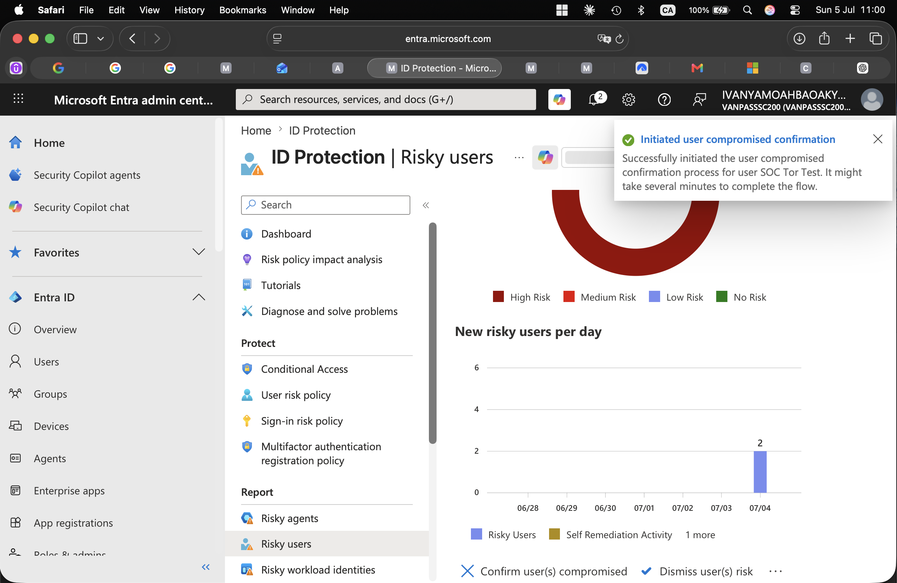
*Entra ID Protection: "Initiated user compromised confirmation" toast for SOC Tor Test — automated remediation triggered*

### Threat Hunting — Telemetry Gap Discovery

**Hypothesis 1:** Brute force attack events (EID 4625) should be visible in the `SecurityEvent` table in `law-soc-atlas`.

```kql
SecurityEvent
| summarize count()
```


*Advanced Hunting result: SecurityEvent table returns count_ = 0 — no Windows Security Events reached law-soc-atlas*

**Hypothesis 2:** Sysmon process events (EID 1) should be visible in the `Event` table.

```kql
Event
| where Source == "Microsoft-Windows-Sysmon"
| summarize count()
```


*Advanced Hunting result: Sysmon Event table returns count_ = 0 — AMA pipeline failure confirmed across both data sources*

**Finding:** Both `SecurityEvent` (EID 4625) and `Event` (Sysmon) tables contain zero records in `law-soc-atlas`. The AMA extension shows as installed, but the pipeline is not delivering data. Root cause: likely a DCR scope mismatch or AMA agent health issue on the Arc-connected machine. This means **Rule 4.1 and Rule 4.2 would never fire** even if the attacks ran — the detection gap is in the data pipeline, not the KQL logic.

This is documented in the [Threat Hunt Report](Threat-Hunt-Report.md) as a Priority 1 finding.

### Prevention — Conditional Access Policy Created

Based on the risky sign-in findings, a Conditional Access policy was created to block future sign-ins from anonymous IPs (Tor exit nodes) before they can authenticate.

**Policy Configuration:**

| Setting | Value |
|---------|-------|
| Policy Name | `ATLAS - Block sign-in risk (anonymous IP)` |
| Applies To | All users |
| Conditions | Sign-in risk ≥ Medium |
| Grant/Block | Block access |
| Status | Report-only (pending enforcement validation) |

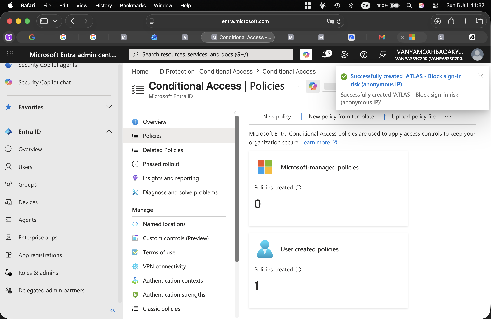
*"Successfully created 'ATLAS - Block sign-in risk (anonymous IP)'" — CA policy live in report-only mode*

---

## 8. Key Findings & Gaps

### What Worked

**Entra ID Protection** detected Tor-based anonymous sign-ins within minutes using two simultaneous ML-based detections (Anonymous IP + Anomalous Token) — no custom rule required. This demonstrates the value of a properly licensed identity platform.

**Microsoft Defender XDR** auto-correlated 8 separate Identity Protection alerts into one High-severity incident with AI-generated technique profiling. A SOC analyst reviewing this incident would immediately understand the scope without manual correlation.

**Manual endpoint containment** using `netsh advfirewall` successfully isolated `DESKTOP-TRF9U79` with a single PowerShell command — demonstrating that effective containment is possible without a commercial EDR when the analyst knows the underlying OS controls.

**Phishing simulation** showed 100% user susceptibility within 44 minutes — a direct, measurable finding that drives a concrete recommendation (mandatory security awareness training) rather than a generic one.

### Gaps Discovered

**Endpoint telemetry gap (Priority 1):** Both `SecurityEvent` and `Event` (Sysmon) tables contain 0 records in `law-soc-atlas` despite the AMA extension showing as provisioned. Custom KQL detection rules 4.1 and 4.2 cannot fire without data. The AMA pipeline is broken — this is the most significant operational gap in the lab.

**No MFA on test accounts:** The Tor sign-in for `soc-tor-test` succeeded with only a password. MFA enforcement via Conditional Access would have blocked the attack before any token was issued.

**Hydra RDP blocked by NLA:** Windows 11 Network Level Authentication blocked Hydra at the TLS handshake level before credentials could be validated. This is a tool limitation, not a detection success — no EID 4625 events were generated.

---

## 9. MITRE ATT&CK Coverage

| # | Technique | ID | Tool / Method | Detection |
|---|-----------|-----|--------------|-----------|
| 1 | Network Service Scanning | T1046 | Nmap | — (pre-attack recon) |
| 2 | Brute Force: Password Guessing | T1110.001 | Hydra 9.5 (rdp://) | Rule 4.1 (EID 4625) — blocked by AMA gap |
| 3 | Command and Scripting: PowerShell | T1059.001 | `powershell -enc` | Rule 4.2 (Sysmon EID 1) — blocked by AMA gap |
| 4 | Obfuscated Files or Information | T1027 | Base64 encoding | Rule 4.2 — blocked by AMA gap |
| 5 | Spearphishing Link | T1566.002 | M365 Attack Simulation Training | Attack Sim report (100% compromise) |
| 6 | Valid Accounts: Cloud Accounts | T1078.004 | soc-tor-test credentials | Entra ID Protection ✅ |
| 7 | Multi-hop Proxy: Tor | T1090.003 | Tor Browser | Anonymous IP detection (ML) ✅ |

Full ATT&CK Navigator layer: [`attack-navigator/atlas-attack-layer.json`](attack-navigator/atlas-attack-layer.json)

---

## 10. KQL Detection Rules

### Rule 4.1 — Brute Force Failed Logon Spike

```kql
// Rule 4.1: Brute Force — Failed Logon Spike (T1110.001)
// Fires when 5+ failed logons occur from the same IP in a 5-minute window
SecurityEvent
| where TimeGenerated > ago(1d)
| where EventID == 4625
| summarize FailedAttempts = count(), Accounts = make_set(Account)
    by Computer, IpAddress, bin(TimeGenerated, 5m)
| where FailedAttempts >= 5
| order by FailedAttempts desc
```

Severity: **Medium** · Tactic: Credential Access · Technique: T1110.001

---

### Rule 4.2 — Encoded PowerShell Execution

```kql
// Rule 4.2: Encoded PowerShell Execution (T1059.001 + T1027)
// Detects powershell.exe launched with -enc / -EncodedCommand via Sysmon EID 1
Event
| where TimeGenerated > ago(1d)
| where Source == "Microsoft-Windows-Sysmon" and EventID == 1
| extend Image       = extract(@"Image:\s*(.*?)\r?\n",       1, RenderedDescription)
| extend CommandLine = extract(@"CommandLine:\s*(.*?)\r?\n", 1, RenderedDescription)
| extend User        = extract(@"User:\s*(.*?)\r?\n",        1, RenderedDescription)
| where Image has_any ("powershell.exe", "powershell_ise.exe")
| where CommandLine has_any ("-enc", "-EncodedCommand", "-e ")
| project TimeGenerated, Computer, User, Image, CommandLine
```

Severity: **High** · Tactic: Execution + Defense Evasion · Technique: T1059.001 + T1027

All KQL files: [`kql/`](kql/)

---

## 11. Threat Hunt Queries

### Hunt 1 — Telemetry Gap Validation

```kql
// Validate SecurityEvent pipeline
SecurityEvent | summarize SecurityEvent_count = count()
// Expected: > 0   |   Actual result: 0   ← AMA pipeline failure

// Validate Sysmon pipeline
Event
| where Source == "Microsoft-Windows-Sysmon"
| summarize Sysmon_count = count()
// Expected: > 0   |   Actual result: 0   ← AMA pipeline failure
```

**Finding:** Both pipelines dead. Detection rules 4.1 and 4.2 would never fire.

### Hunt 2 — Anonymous IP Sign-ins (Tor / VPN Proxy)

```kql
// Hunt for risky sign-ins from anonymous proxies
AADSignInEventsBeta
| where TimeGenerated > ago(7d)
| where RiskLevelDuringSignIn >= 50
| where IsAnonymousProxy == 1
| project TimeGenerated, AccountUpn, IPAddress, City, CountryCode, RiskLevelDuringSignIn
| order by TimeGenerated desc
```

**Finding:** 5 events confirmed — Tor exit nodes in Karlsruhe (DE), SE region, Camperduin (NL).

Full threat hunt: [`Threat-Hunt-Report.md`](Threat-Hunt-Report.md)

---

## 12. Deliverables

| Document | Description |
|----------|-------------|
| [Post-Incident-Review.md](Post-Incident-Review.md) | Root cause analysis, timeline, recommendations |
| [Threat-Hunt-Report.md](Threat-Hunt-Report.md) | Hypothesis-driven hunt — telemetry gap discovery |
| [Escalation-and-SOAR-Playbook.md](Escalation-and-SOAR-Playbook.md) | Tier 1→2 escalation criteria + Logic App automation |
| [kql/rule-4.1-brute-force.kql](kql/rule-4.1-brute-force.kql) | Brute force detection rule |
| [kql/rule-4.2-encoded-powershell.kql](kql/rule-4.2-encoded-powershell.kql) | Encoded PowerShell detection rule |
| [kql/hunt-anonymous-ip-signins.kql](kql/hunt-anonymous-ip-signins.kql) | Threat hunt — anonymous proxy sign-ins |
| [kql/hunt-telemetry-gap-check.kql](kql/hunt-telemetry-gap-check.kql) | Telemetry coverage validation query |
| [attack-navigator/atlas-attack-layer.json](attack-navigator/atlas-attack-layer.json) | MITRE ATT&CK Navigator heatmap |
| [assets/banner.svg](assets/banner.svg) | Lab architecture diagram |
| [Project-ATLAS-SOC-Tier1-Blueprint.md](Project-ATLAS-SOC-Tier1-Blueprint.md) | Full lab blueprint and design notes |

---

<div align="center">

**Built by Ivan Yamoah Baoakye · July 2026**

*SC-200: Microsoft Security Operations Analyst · Project ATLAS*

</div>
