<div align="center">

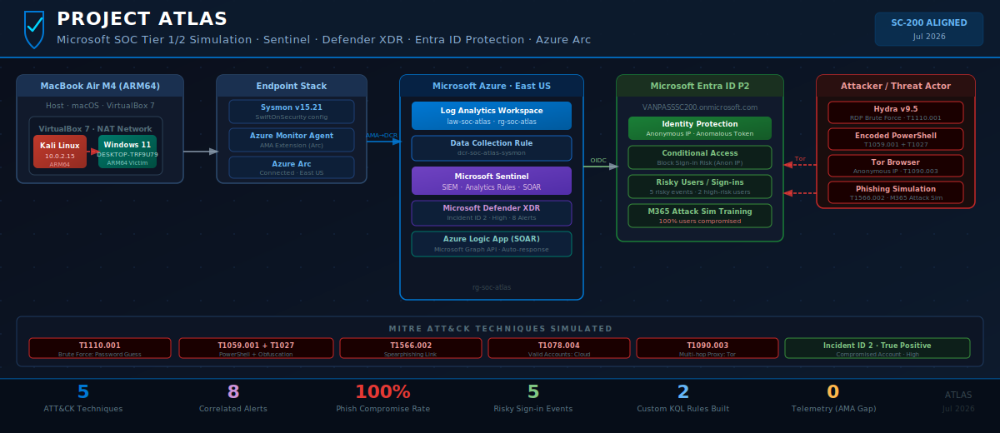

# Project ATLAS — Microsoft SOC Tier 1/2 Simulation

> A self-directed, end-to-end Security Operations Centre simulation built on Microsoft Sentinel, Entra ID Protection, and a custom attacker/victim lab. Covering the full incident lifecycle: detection engineering, adversary simulation, triage, containment, identity remediation, and proactive threat hunting.

[](https://azure.microsoft.com/en-us/products/microsoft-sentinel)
[](https://security.microsoft.com)
[](https://attack.mitre.org/)
[]()

</div>

---

## Table of Contents

1. [Lab Architecture](#1-lab-architecture)
2. [Day 1 — Lab Provisioning & Infrastructure Setup](#2-day-1--lab-provisioning--infrastructure-setup)
3. [Day 2 — Telemetry Pipeline: Sysmon + Azure Arc + AMA + DCR](#3-day-2--telemetry-pipeline-sysmon--azure-arc--ama--dcr)
4. [Day 2 — Detection Engineering: Custom Sentinel Analytics Rules](#4-day-2--detection-engineering-custom-sentinel-analytics-rules)
5. [Day 3 — Attack Simulation: MITRE ATT&CK Execution](#5-day-3--attack-simulation-mitre-attck-execution)
6. [Day 4 — Incident Triage & Investigation](#6-day-4--incident-triage--investigation)
7. [Day 5 — Containment, Identity Remediation & Threat Hunting](#7-day-5--containment-identity-remediation--threat-hunting)
8. [Key Findings & Gaps](#8-key-findings--gaps)
9. [MITRE ATT&CK Coverage](#9-mitre-attck-coverage)
10. [KQL Detection Rules](#10-kql-detection-rules)
11. [Deliverables](#11-deliverables)

---

## 1. Lab Architecture

The lab simulates a hybrid enterprise environment: a local victim machine running inside VirtualBox on an Apple Silicon MacBook Air is connected to Azure via Azure Arc. A Kali Linux VM on the same NAT network acts as the attacker. All endpoint telemetry flows through the Azure Monitor Agent into a Log Analytics Workspace, with Microsoft Sentinel and Defender XDR providing SIEM/XDR coverage. Identity attacks are handled by Entra ID Protection.

| Component | Detail |
|-----------|--------|
| Host Machine | MacBook Air M4 (ARM64) · macOS |
| Victim VM | Windows 11 ARM64 · `DESKTOP-TRF9U79` · VirtualBox NAT `10.0.2.2:33389` |
| Attacker VM | Kali Linux ARM64 · VirtualBox NAT `10.0.2.15` |
| Azure Tenant | `VANPASSSC200.onmicrosoft.com` |
| Resource Group | `rg-soc-atlas` · East US |
| Log Analytics Workspace | `law-soc-atlas` |
| SIEM | Microsoft Sentinel |
| XDR | Microsoft Defender XDR |
| Identity | Entra ID P2 · Identity Protection · Conditional Access |
| Endpoint Telemetry | Sysmon v15.21 + AMA + DCR `dcr-soc-atlas-sysmon` |

---

## 2. Day 1 — Lab Provisioning & Infrastructure Setup

The first session built the cloud and identity foundation: provisioning the Azure resource group, enabling Entra ID P2, creating the Log Analytics Workspace (`law-soc-atlas`), onboarding the Windows VM to Azure Arc, and activating Microsoft Sentinel.

Entra ID P2 was assigned to enable Identity Protection and Conditional Access — without it, the identity-based attacks in Days 3–5 would go completely undetected. The Azure Arc onboarding script was generated from the portal and executed in an elevated PowerShell session on `DESKTOP-TRF9U79`, registering it as a managed hybrid machine in `rg-soc-atlas`. Microsoft Sentinel was then connected to `law-soc-atlas`, activating the SIEM layer.

---

## 3. Day 2 — Telemetry Pipeline: Sysmon + Azure Arc + AMA + DCR

With the cloud foundation in place, the next session built the endpoint telemetry pipeline to stream Sysmon process events and Windows Security Event 4625 from the victim VM into Sentinel in real time.

### Azure Arc — Connected

Before installing any agents, Arc connectivity was confirmed. A "Connected" status means the VM is registered as an Azure resource and can receive DCR assignments.

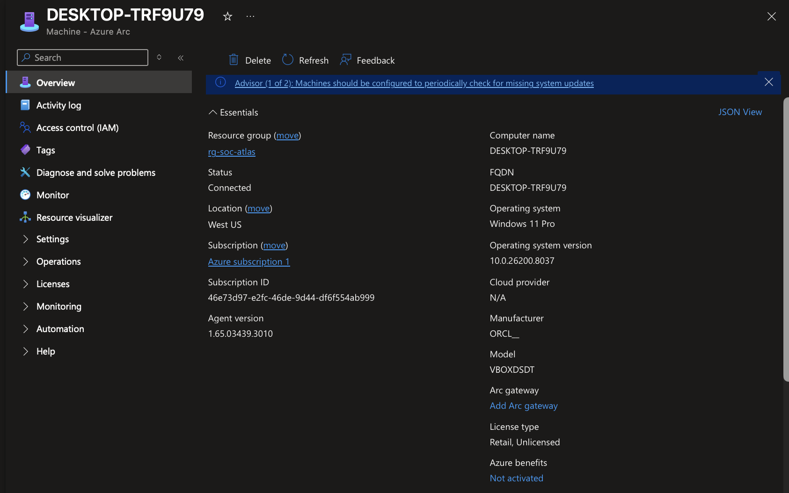
*DESKTOP-TRF9U79 status: Connected in Azure Arc — registered as a hybrid machine in rg-soc-atlas*

### Sysmon v15.21 — Generating Events Locally

Sysmon was installed with the SwiftOnSecurity baseline configuration. Before trusting the cloud pipeline, local event generation was verified in Event Viewer — isolating any future telemetry gap to the AMA → DCR layer rather than the sensor itself.

```powershell
.\Sysmon64.exe -accepteula -i sysmonconfig-export.xml
```

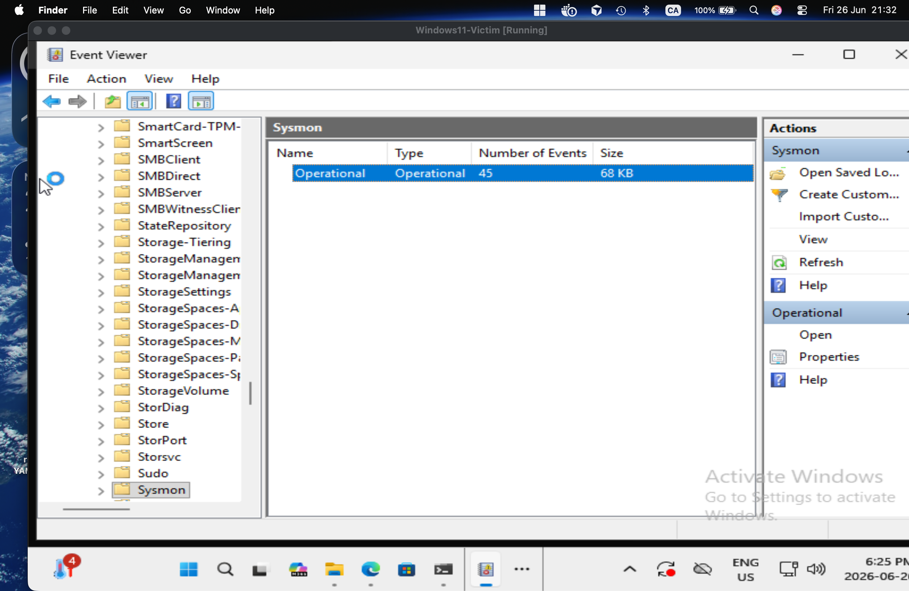
*Event Viewer: Microsoft-Windows-Sysmon/Operational — 45 events, 68 KB. Sysmon is writing locally — pipeline verification step 1 of 2.*

### Data Collection Rule — Configured

The DCR (`dcr-soc-atlas-sysmon`) defines what to collect and where to send it. It is scoped to the Azure Arc machine and configured to forward `Microsoft-Windows-Sysmon/Operational` events and Windows Security Event ID 4625 to `law-soc-atlas`.

| Setting | Value |
|---------|-------|
| DCR Name | `dcr-soc-atlas-sysmon` |
| Scope | `DESKTOP-TRF9U79` (Azure Arc machine) |
| Data Source 1 | `Microsoft-Windows-Sysmon/Operational` |
| Data Source 2 | Windows Security Events — EID 4625 |
| Destination | `law-soc-atlas` |

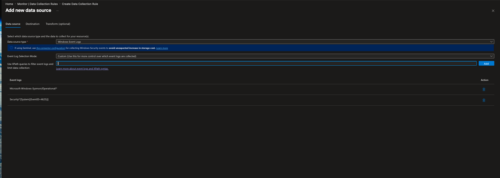
*DCR data sources: Microsoft-Windows-Sysmon/Operational + Windows Security EID 4625 configured and scoped to DESKTOP-TRF9U79*

> **Critical Finding (Day 5):** Despite the AMA extension showing as installed, both the `SecurityEvent` and `Event` (Sysmon) tables in `law-soc-atlas` returned 0 records. The pipeline looked healthy but delivered nothing — confirmed via Advanced Hunting. See [Section 7](#7-day-5--containment-identity-remediation--threat-hunting).

---

## 4. Day 2 — Detection Engineering: Custom Sentinel Analytics Rules

Two custom analytics rules were written from scratch in KQL to detect the specific attack techniques being simulated.

### Rule 4.1 — Brute Force Failed Logon Spike (T1110.001)

Detects 5 or more failed logon attempts (EID 4625) from the same source IP in a 5-minute window. Full entity mapping (Computer, IpAddress) ensures incidents automatically enrich with asset context.

```kql
SecurityEvent
| where TimeGenerated > ago(1d)
| where EventID == 4625
| summarize FailedAttempts = count(), Accounts = make_set(Account) by Computer, IpAddress, bin(TimeGenerated, 5m)
| where FailedAttempts >= 5
| order by FailedAttempts desc
```

| Setting | Value |
|---------|-------|
| Severity | Medium |
| MITRE | T1110.001 — Credential Access |
| Frequency | Every 5 minutes |
| Threshold | ≥ 5 failed logons per 5-min window |

### Rule 4.2 — Encoded PowerShell Execution (T1059.001 + T1027)

Detects PowerShell launched with `-enc` / `-EncodedCommand` via Sysmon EID 1 (Process Create). Parses the `RenderedDescription` field to extract Image, CommandLine, and User.

```kql
Event
| where TimeGenerated > ago(1d)
| where Source == "Microsoft-Windows-Sysmon" and EventID == 1
| extend Image       = extract(@"Image:\s*(.*?)\r?\n",       1, RenderedDescription)
| extend CommandLine = extract(@"CommandLine:\s*(.*?)\r?\n", 1, RenderedDescription)
| extend User        = extract(@"User:\s*(.*?)\r?\n",        1, RenderedDescription)
| where Image has_any ("powershell.exe", "powershell_ise.exe")
| where CommandLine has_any ("-enc", "-EncodedCommand", "-e ")
| project TimeGenerated, Computer, User, Image, CommandLine
```

| Setting | Value |
|---------|-------|
| Severity | High |
| MITRE | T1059.001 + T1027 — Execution + Defense Evasion |
| Data Source | Sysmon EID 1 via `Event` table |

### Both Rules Active

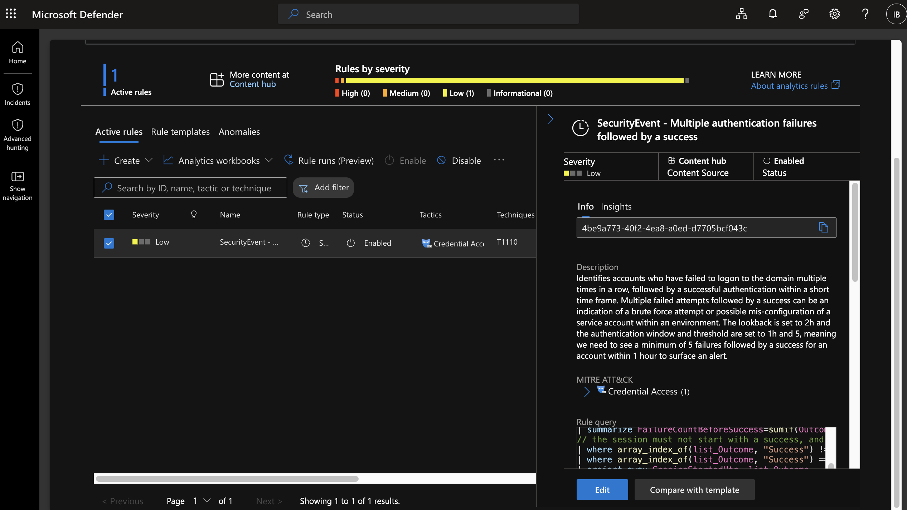
*Both custom analytics rules running in Microsoft Sentinel — detection engineering phase complete*

---

## 5. Day 3 — Attack Simulation: MITRE ATT&CK Execution

Five MITRE ATT&CK techniques were executed across endpoint and cloud attack surfaces.

### T1046 — Network Reconnaissance

Nmap confirmed RDP was reachable on the NAT-forwarded port before launching the brute force.

```bash
nmap -p 33389 10.0.2.2
```

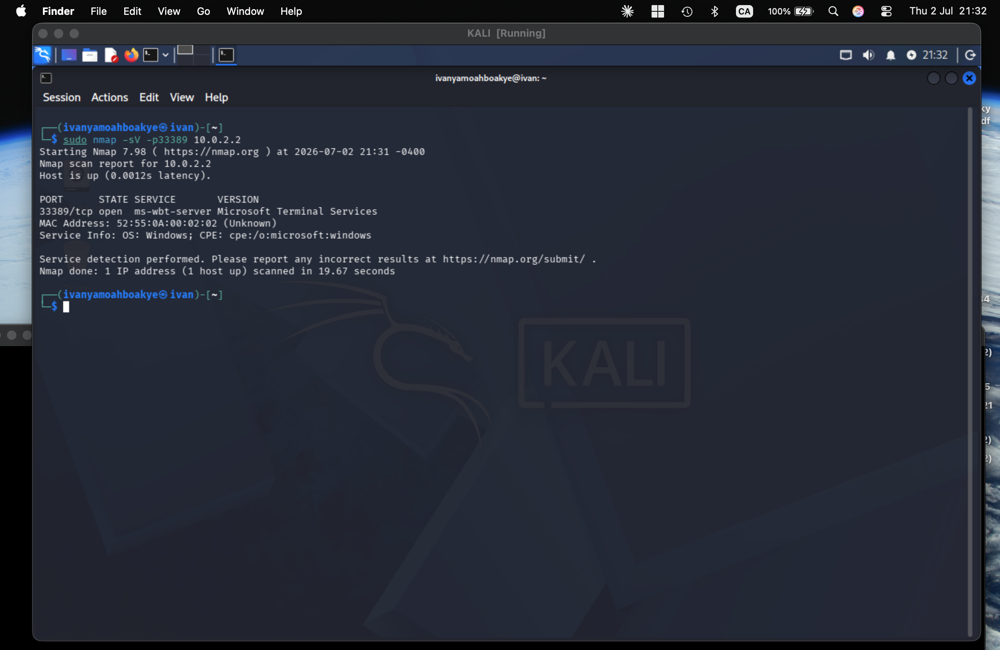
*Nmap: 33389/tcp open ms-wbt-server — RDP is exposed and reachable on the victim VM*

### T1110.001 — Brute Force: Password Guessing

Hydra executed an automated credential attack against the Windows VM's RDP service using a targeted 7-password wordlist.

```bash
hydra -l ivan -P /tmp/password.txt rdp://10.0.2.2:33389
```

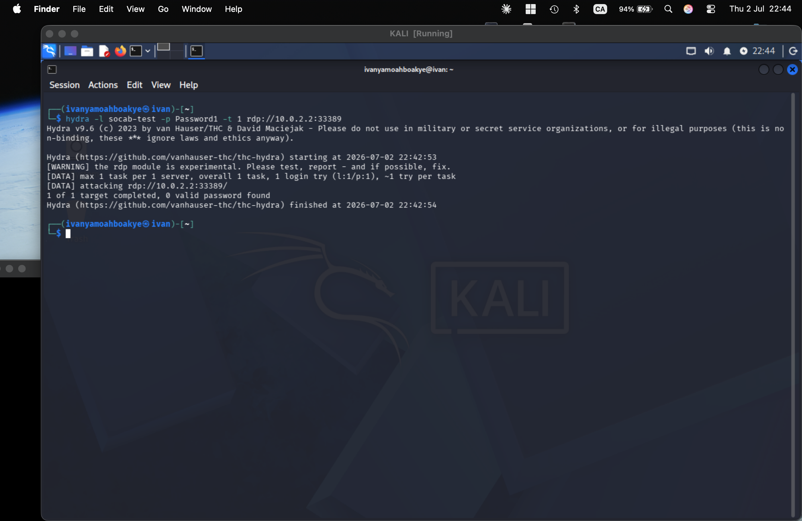
*Hydra v9.5 executing RDP brute force against 10.0.2.2:33389 — T1110.001 in progress*

> Windows 11 NLA blocked Hydra at the transport layer — a tool limitation, not a detection success. No EID 4625 events were generated.

### T1059.001 + T1027 — Encoded PowerShell Execution

`whoami` was Base64-encoded and executed via `-enc` to simulate a real obfuscated payload.

```powershell
$e = [Convert]::ToBase64String([System.Text.Encoding]::Unicode.GetBytes("whoami"))
powershell -enc $e
```

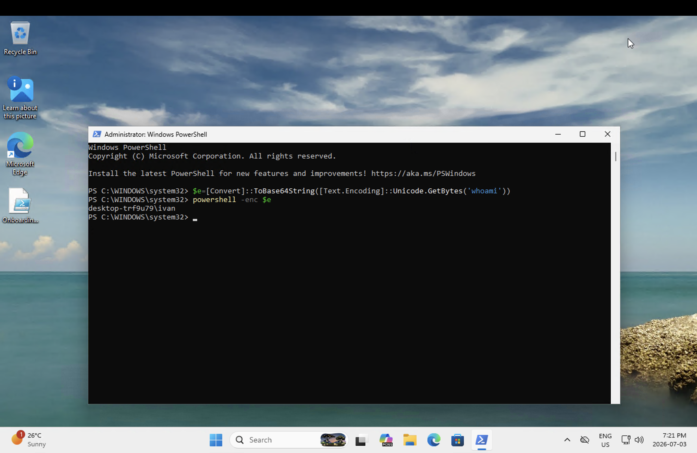
*T1059.001 + T1027: `powershell -enc $e` returns `desktop-trf9u79\ivan` — obfuscated payload executes successfully*

### T1566.002 — Spearphishing Link

A Microsoft 365 Attack Simulation Training campaign (Baseline Credential Harvest) was launched from Defender XDR. The phishing email landed in the victim's inbox within minutes.

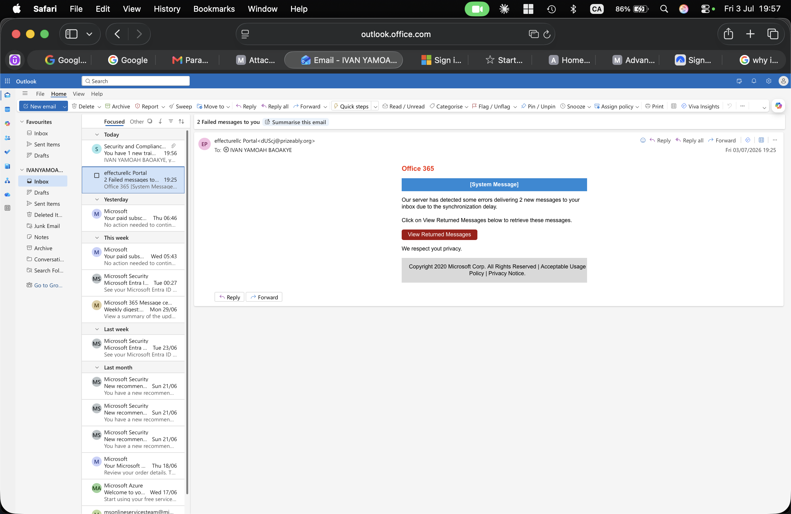
*T1566.002: Phishing email delivered to IVAN YAMOAH BAOAKYE's inbox — "Office 365 [System Message]" credential harvest lure*

**Result — 100% Compromise:**

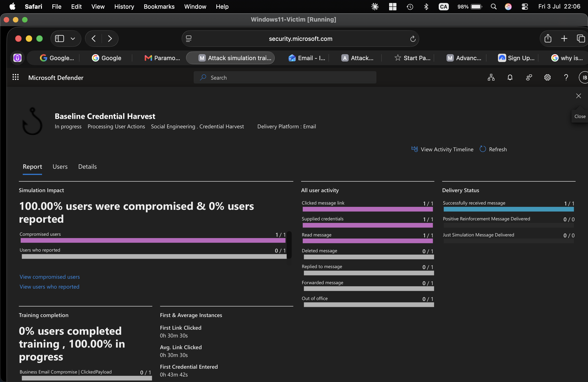
*Simulation report: 1/1 users clicked (30m 30s), 1/1 credentials submitted (43m 42s) — 100% compromise rate*

### T1078.004 + T1090.003 — Valid Accounts via Tor

A test account (`soc-tor-test`) was created and signed in via Tor Browser to simulate an attacker using anonymized infrastructure to access cloud resources.

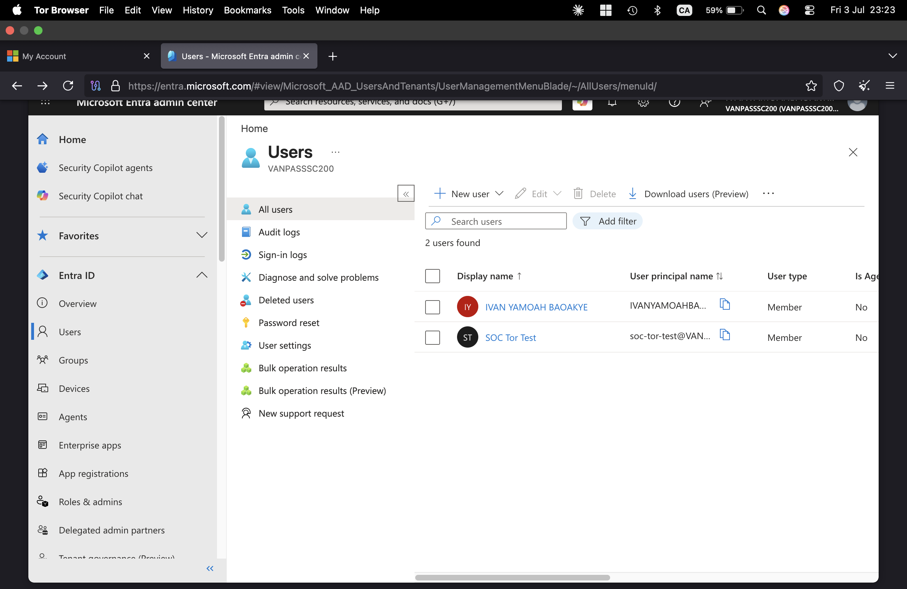
*T1090.003 success — admin account accessed the Entra ID admin center via Tor exit node*

---

## 6. Day 4 — Incident Triage & Investigation

Defender XDR auto-correlated multiple Entra ID Protection alerts into a single High-severity incident within minutes of the Tor sign-ins.

### Risky Sign-ins Detected

Entra ID Protection fired 5 risky sign-in events flagged as "At risk" from Tor exit nodes across Germany, Sweden, and the Netherlands.

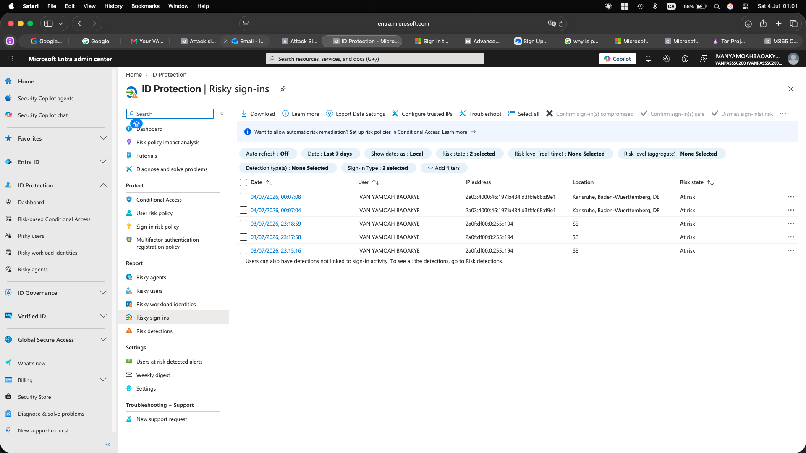
*Entra ID Protection: 5 risky sign-in events for IVAN YAMOAH BAOAKYE — all "At risk", sourced from Tor exit nodes (DE, SE, NL)*

Each sign-in triggered two simultaneous ML-based detections: **Anonymous IP address** and **Anomalous token** — both at High risk level.

### Incident ID 2 — Auto-Correlated by Defender XDR

Defender XDR automatically correlated 8 of 9 Identity Protection alerts into **Incident ID 2** with no manual input.

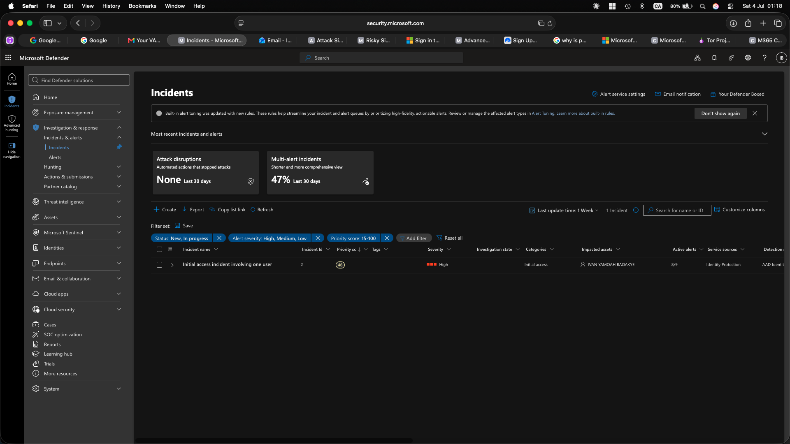
*Incident ID 2 — High severity, 8/9 alerts correlated, Identity Protection source, impacted user: IVAN YAMOAH BAOAKYE*

### Incident Classified — True Positive

After reviewing the evidence, the incident was classified as a True Positive — Compromised Account.

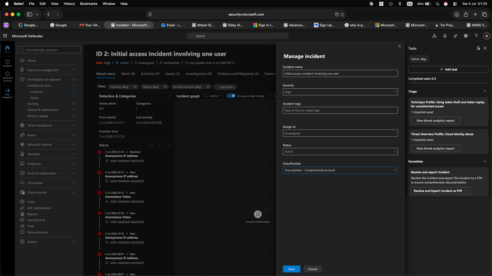
*Incident ID 2 classified: True positive — Compromised account*

| Field | Value |
|-------|-------|
| Incident ID | 2 |
| Severity | High |
| Alerts | 8 / 9 correlated |
| First Activity | Jul 3, 2026 23:14:11 |
| Last Activity | Jul 4, 2026 00:07:08 |
| Impacted User | IVAN YAMOAH BAOAKYE |
| Classification | True positive — Compromised account |

---

## 7. Day 5 — Containment, Identity Remediation & Threat Hunting

### Endpoint Containment — Windows Firewall Isolation

`DESKTOP-TRF9U79` was isolated manually using `netsh advfirewall` — blocking all inbound and outbound traffic.

```powershell
netsh advfirewall set allprofiles firewallpolicy blockinbound,blockoutbound
```

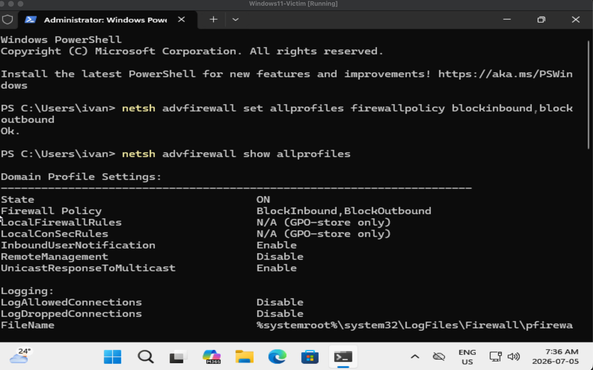
*Endpoint isolation confirmed: blockinbound,blockoutbound returns Ok. — all traffic blocked across all profiles*

### Threat Hunt — Telemetry Gap Discovery

**Hypothesis:** Brute force and Sysmon events should be visible in `law-soc-atlas`.

```kql
SecurityEvent | summarize count()
// Result: 0

Event | where Source == "Microsoft-Windows-Sysmon" | summarize count()
// Result: 0
```

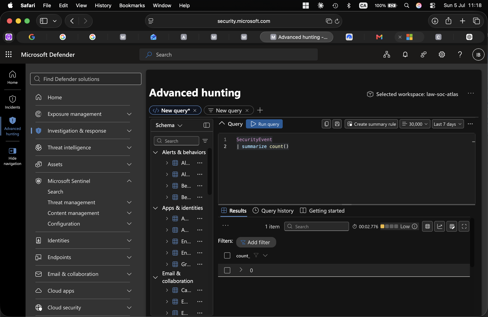
*Advanced Hunting: SecurityEvent count_ = 0 — AMA pipeline failure confirmed. Rules 4.1 and 4.2 would never have fired.*

**Finding:** Both `SecurityEvent` and `Event` (Sysmon) tables are empty in `law-soc-atlas`. The AMA extension was provisioned but the pipeline was not delivering data. This is the central finding of the [Threat Hunt Report](Threat-Hunt-Report.md).

Identity remediation was completed by triggering `Confirm compromised` in Entra ID Protection on both affected accounts, revoking sessions and initiating forced password reset. A Conditional Access policy (`ATLAS - Block sign-in risk (anonymous IP)`) was created in report-only mode to block future Tor-based sign-ins.

---

## 8. Key Findings & Gaps

**Entra ID Protection** detected Tor sign-ins within minutes using two simultaneous ML detections — no custom rule required.

**Defender XDR** auto-correlated 8 alerts into one High-severity incident with AI threat profiling, reducing triage time to minutes.

**Manual containment** via `netsh advfirewall` successfully isolated the endpoint without a commercial EDR.

**Phishing simulation** produced a 100% compromise rate — a direct, measurable finding that drives concrete recommendations.

**Endpoint telemetry gap (Priority 1):** Both `SecurityEvent` and `Event` (Sysmon) tables contain 0 records despite the AMA showing as provisioned. Detection rules 4.1 and 4.2 cannot fire. Root cause: DCR scope or AMA agent health issue on the Arc machine.

**No MFA on test accounts:** The Tor sign-in succeeded with only a password — Conditional Access with MFA enforcement would have blocked it.

---

## 9. MITRE ATT&CK Coverage

| Technique | ID | Tool | Detection |
|-----------|-----|------|-----------|
| Network Service Scanning | T1046 | Nmap | — |
| Brute Force: Password Guessing | T1110.001 | Hydra 9.5 | Rule 4.1 (blocked by AMA gap) |
| PowerShell Execution | T1059.001 | `powershell -enc` | Rule 4.2 (blocked by AMA gap) |
| Obfuscated Files or Information | T1027 | Base64 encoding | Rule 4.2 (blocked by AMA gap) |
| Spearphishing Link | T1566.002 | M365 Attack Sim | 100% compromise confirmed ✅ |
| Valid Accounts: Cloud | T1078.004 | soc-tor-test | Entra ID Protection ✅ |
| Multi-hop Proxy: Tor | T1090.003 | Tor Browser | Anonymous IP ML detection ✅ |

Full ATT&CK Navigator layer: [`attack-navigator/atlas-attack-layer.json`](attack-navigator/atlas-attack-layer.json)

---

## 10. KQL Detection Rules

All rule files: [`kql/`](kql/)

### Rule 4.1 — Brute Force

```kql
SecurityEvent
| where TimeGenerated > ago(1d)
| where EventID == 4625
| summarize FailedAttempts = count(), Accounts = make_set(Account) by Computer, IpAddress, bin(TimeGenerated, 5m)
| where FailedAttempts >= 5
| order by FailedAttempts desc
```

### Rule 4.2 — Encoded PowerShell

```kql
Event
| where TimeGenerated > ago(1d)
| where Source == "Microsoft-Windows-Sysmon" and EventID == 1
| extend Image       = extract(@"Image:\s*(.*?)\r?\n",       1, RenderedDescription)
| extend CommandLine = extract(@"CommandLine:\s*(.*?)\r?\n", 1, RenderedDescription)
| extend User        = extract(@"User:\s*(.*?)\r?\n",        1, RenderedDescription)
| where Image has_any ("powershell.exe", "powershell_ise.exe")
| where CommandLine has_any ("-enc", "-EncodedCommand", "-e ")
| project TimeGenerated, Computer, User, Image, CommandLine
```

---

## 11. Deliverables

| Document | Description |
|----------|-------------|
| [Post-Incident-Review.md](Post-Incident-Review.md) | Root cause analysis, timeline, recommendations |
| [Threat-Hunt-Report.md](Threat-Hunt-Report.md) | Hypothesis-driven hunt — telemetry gap discovery |
| [Escalation-and-SOAR-Playbook.md](Escalation-and-SOAR-Playbook.md) | Tier 1→2 escalation criteria + Logic App automation |
| [kql/rule-4.1-brute-force.kql](kql/rule-4.1-brute-force.kql) | Brute force detection rule |
| [kql/rule-4.2-encoded-powershell.kql](kql/rule-4.2-encoded-powershell.kql) | Encoded PowerShell detection rule |
| [kql/hunt-anonymous-ip-signins.kql](kql/hunt-anonymous-ip-signins.kql) | Threat hunt — anonymous proxy sign-ins |
| [kql/hunt-telemetry-gap-check.kql](kql/hunt-telemetry-gap-check.kql) | Telemetry coverage validation query |
| [attack-navigator/atlas-attack-layer.json](attack-navigator/atlas-attack-layer.json) | MITRE ATT&CK Navigator heatmap |
| [assets/banner.svg](assets/banner.svg) | Lab architecture diagram |

---

<div align="center">

**Built by Ivan Yamoah Baoakye · July 2026**

</div>
